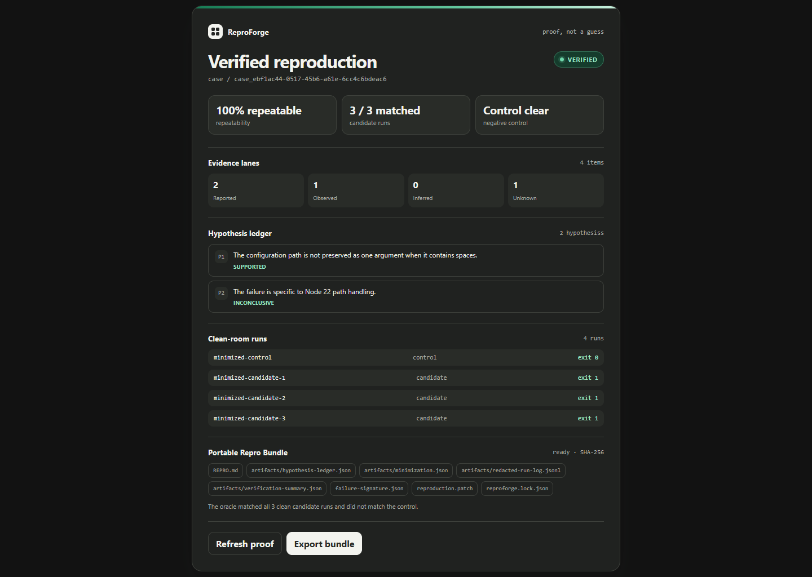
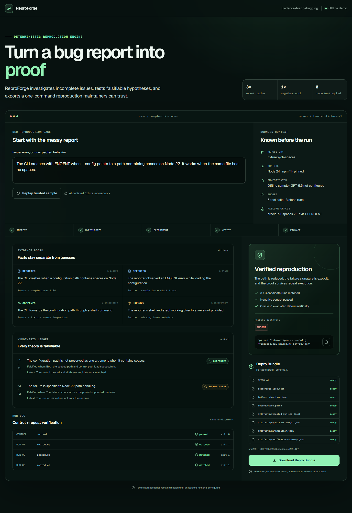

# ReproForge

[](https://github.com/GhostlyGawd/reproforge/actions/workflows/ci.yml)

> Issue in. Deterministic, one-command failing reproduction out.

ReproForge turns an incomplete bug report into a verified, portable reproduction. It keeps reported facts separate from observations and inferences, tests falsifiable hypotheses within a bounded budget, verifies a machine-readable failure oracle against a negative control and three clean runs, then exports an independently validatable Repro Bundle.

The implemented v2 slice is API-first internally and plugin-first for distribution: ChatGPT supplies the conversational surface under the user's subscription, while ReproForge supplies MCP tools, deterministic verification, and artifacts. The trusted ChatGPT path requires no user-provided OpenAI API key; the Responses API remains an optional standalone adapter. See the [v2 product specification](docs/product-spec-v2.md) and [architecture decision](docs/adr/0001-api-first-plugin-first.md).





## Why ReproForge

- **Proof before diagnosis:** model output can propose experiments, but only deterministic application code can mark a case verified.
- **Honest terminal states:** unstable, blocked, and not-reproduced cases are product outcomes rather than hidden failures.
- **Auditable investigation:** evidence sources, hypothesis priority and history, commands, outputs, oracle version, and minimization decisions remain inspectable.
- **Portable handoff:** the final reproduction runs without an OpenAI API key or a ReproForge server.
- **Fail-closed execution:** only an authorized immutable GitHub revision with
  the supported Node/npm profile can reach the isolated runner; arbitrary
  repositories, URLs, branches, and commands are rejected.

## Five-minute trusted demo

Prerequisites: Node.js 20.9 or newer and npm. No Docker, GitHub token, or OpenAI API key is required.

```bash
git clone https://github.com/GhostlyGawd/reproforge.git
cd reproforge
npm ci
npm run dev
```

Open [http://localhost:3000](http://localhost:3000), select **Run trusted sample**, and follow the issue-to-bundle timeline. The sample is deterministic and always identifies itself as offline.

## ChatGPT/MCP trusted demo

With the same development server running, ReproForge exposes a stateless
Streamable HTTP endpoint at `http://127.0.0.1:3000/mcp` and the exact embedded
resource at [http://127.0.0.1:3000/widget-preview](http://127.0.0.1:3000/widget-preview).
Run the deterministic protocol journey with:

```bash
npm run mcp:smoke
```

It discovers exactly `start_reproduction`, `list_authorized_repositories`,
`get_reproduction`, `cancel_reproduction`, and `export_repro_bundle`, then
starts, retries, reads, and exports the trusted fixture with `OPENAI_API_KEY`
absent. The trusted sample remains no-auth; repository list/start/cancel use
declared OAuth scopes and server-owned identity. No tool accepts a repository
URL, arbitrary command, source body, ChatGPT credential, provider token, or
OpenAI key.

ChatGPT developer mode requires a reachable HTTPS endpoint and a real
account-created app ID; neither is faked in this repository. See the
[ChatGPT app and plugin guide](docs/chatgpt-plugin.md) for MCP Inspector,
developer-mode, local packaging, and public-submission steps.

## Headless REST v2 sample

The same trusted journey is available through a transport-neutral case/job service. Start it with a caller-generated idempotency key:

```bash
curl --request POST http://localhost:3000/api/v2/reproductions \
  --header "Content-Type: application/json" \
  --header "Idempotency-Key: demo-1" \
  --data '{"sampleId":"cli-spaces"}'
```

The response returns `case.id`, `job.id`, and schema-versioned proof data. Repeat the exact request with the same key to reuse the result without executing it twice. Poll or export with:

```text
GET /api/v2/reproductions/{caseId}
GET /api/v2/jobs/{jobId}
GET /api/v2/reproductions/{caseId}/bundle
```

No OpenAI API key is used. Local `offline` and `test` modes intentionally use
process-local memory. A fully configured `preview` or `production` runtime
selects the verified Neon Postgres, private Vercel Blob, and Vercel Queue
adapters; partial hosted configuration fails closed instead of falling back to
memory. See the [operations guide](docs/operations.md) before enabling a hosted
mode.

## Account data lifecycle

In a fully configured hosted runtime, signed-in users can open `/account` to
download one integrity-checked tenant archive or explicitly request permanent
deletion. The export contains the canonical manifest plus its private
content-addressed objects, is quota-bounded, and requires work to be quiescent.
Deletion immediately suspends new starts, requests cancellation of active work,
deletes provider objects before database state, and retains only the documented
sanitized tombstone. These controls use the web session and never ask the user
for an OpenAI or GitHub API token.

The local page deliberately renders the real controls disabled when identity is
not configured. Live export/deletion and backup/restore drills remain required
before private-beta completion; see the [operations guide](docs/operations.md)
and [Milestone 8D evidence](docs/evidence/milestone-8d/README.md).

## Run the exported reproduction directly

This command exercises the same intentionally defective spaced-path fixture represented in the sample bundle:

```bash
npm run fixture:repro -- --config "fixtures/cli-spaces/my config.json"
```

The expected result is exit code `1` with an `ENOENT` message. That failure is the successful reproduction. The negative control exits `0`:

```bash
npm run fixture:repro -- --config "fixtures/cli-spaces/config.json"
```

## Verify the repository

Install the Playwright browser once, then run the same aggregate gate used by CI:

```bash
npx playwright install chromium
npm run verify
```

The gate runs linting, strict type checking, unit and property tests, executable BDD scenarios, a production build, the deterministic eval suite, browser journeys, responsive checks, and an automated accessibility scan.

Run the benchmark alone with:

```bash
npm run eval
```

The committed four-case suite covers a verified positive, a negative no-match, an intermittent reproduction, and a misleading candidate whose oracle also matches the control.

## How it works

1. ChatGPT/MCP, browser, and REST adapters translate requests into the same transport-neutral case-operation commands.
2. Offline modes use an in-memory repository. Hosted modes atomically reserve tenant-keyed Postgres case/job/idempotency/quota/audit/outbox state, publish an identifier-only Queue intent, execute the trusted worker under a lease, and commit a private content-addressed bundle before success.
3. An offline or optional GPT-5.6 investigator proposes evidence-linked hypotheses and bounded typed tool calls.
4. The trusted sample uses its allowlisted runner. The protected repository path
   verifies OAuth principal/tenant scopes, GitHub App installation membership,
   and an immutable commit before reserving work.
5. The trusted host streams a bounded GitHub archive and injects bytes—not a
   token—into Vercel Sandbox. Dependencies are prepared with lifecycle scripts
   disabled; repository code runs only under deny-all network policy.
6. A prepared snapshot produces one clean control and three fresh candidate
   microVMs under stable time/workspace/output/cancellation/cleanup policy.
7. A pure oracle engine evaluates captured results. Verification requires every
   candidate to match and the control not to match.
8. The minimizer accepts only a proposed reduction that preserves the same
   verification result on fresh runs.
9. The bundle builder redacts, hashes, serializes, and validates the artifact
   contract; the MCP App renders but never decides the outcome.


See the [architecture and trust-boundary guide](docs/architecture.md) for the module map and data flow.

## Repro Bundle contract

```text
repro-bundle/
  REPRO.md
  reproforge.lock.json
  failure-signature.json
  reproduction.patch
  artifacts/
    redacted-run-log.jsonl
    hypothesis-ledger.json
    minimization.json
    verification-summary.json
```

The lock records the immutable revision and tree hash, dependency-lock hash, runtime, package manager, runner identity, non-secret environment facts, oracle identity and version, command, and ReproForge version. Bundle validation rejects missing files, mismatched hashes, unredacted registered secrets, or lock/oracle disagreement.

## Optional GPT-5.6 investigator

The deterministic sample does not silently switch modes. To enable the separate live investigator API, copy `.env.example` to `.env.local`, add `OPENAI_API_KEY`, and restart the app. Live mode uses `gpt-5.6-sol` through the Responses API with explicit medium reasoning, strict non-executing tools, `store: false`, and preserved response output items during continuation.

The model structures evidence and proposes experiments; it cannot execute commands, weaken the oracle, or declare verification. See the [OpenAI integration contract](docs/openai-integration.md). A live smoke test is optional and was not used for the committed offline evidence.

This key is required only for the current optional standalone Responses route. It is not a product invariant and will not be required by the subscription-first ChatGPT/MCP journey.

## Documentation

- [Product and technical specification](docs/product-spec.md)
- [Milestone roadmap and task breakdown](docs/roadmap.md)
- [Approved v2 product and platform specification](docs/product-spec-v2.md)
- [V2 delivery roadmap and GitHub milestones](docs/roadmap-v2.md)
- [API-first/plugin-first architecture decision](docs/adr/0001-api-first-plugin-first.md)
- [Managed production-stack decision](docs/adr/0002-managed-production-stack.md)
- [Ordered remaining delivery specifications](docs/specs/README.md)
- [ChatGPT app, MCP inspection, and plugin guide](docs/chatgpt-plugin.md)
- [Test and evidence strategy](docs/test-strategy.md)
- [Hosted operations and recovery runbook](docs/operations.md)
- [Architecture and trust boundaries](docs/architecture.md)
- [Security model](docs/security.md) and [security reporting policy](SECURITY.md)
- [Privacy behavior](docs/privacy.md)
- [Current limitations](docs/limitations.md)
- [Artifact and asset provenance](docs/provenance.md)
- [Release status](docs/release-status.md)
- [Completion audit](docs/completion-audit.md)
- [Headless case/job service evidence](docs/evidence/milestone-6/README.md)
- [ChatGPT MCP app evidence](docs/evidence/milestone-7/README.md)
- [Durable provider evidence](docs/evidence/milestone-8a/README.md)
- [Isolated runner and public-canary evidence](docs/evidence/milestone-8c/README.md)
- [Private-beta implementation evidence](docs/evidence/milestone-8d/README.md)
- [Contributing](CONTRIBUTING.md) and [support](SUPPORT.md)

## Project status

ReproForge is a pre-alpha Build Week prototype. The complete bundled
JavaScript/TypeScript fixture journey works through the browser, REST v2,
Streamable HTTP MCP, and the embedded proof widget. Offline use remains
in-memory and credential-free. The hosted durable foundation is implemented
and provider-verified against Neon Postgres, private Vercel Blob, Vercel Queue,
and Vercel Sandbox. A tiny immutable public repository canary has completed the
full isolated path—bounded acquisition, dependency preparation, one control,
three fresh candidates, deterministic proof, portable bundle, and cleanup.
Resilience and account export/deletion controls are implemented and locally
verified, but their deployed recovery and lifecycle drills remain open. Live
account authorization, general/private repository use, the composed stable
hosted journey, production hosting, and plugin publication remain intentionally
unavailable. The synthetic four-case eval and public canary are contract checks,
not claims of real-world benchmark performance.

No package, release, deployment, or stable API is promised. Consult the [release status](docs/release-status.md) and [limitations](docs/limitations.md) before relying on the project.

## License

No license has been selected. All rights are reserved until the repository owner explicitly chooses one.
