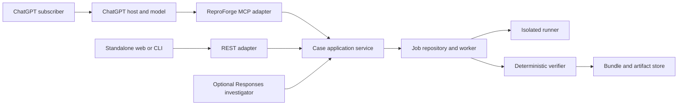

# ADR 0001: API-first core with plugin-first distribution

- **Status:** Accepted
- **Decision date:** 2026-07-19
- **Owners:** ReproForge maintainers
- **Related issue:** [#10](https://github.com/GhostlyGawd/reproforge/issues/10)

## Context

The trusted-fixture MVP proves ReproForge's deterministic verification model in a local Next.js application. Its optional live investigator calls the OpenAI Responses API with a developer-supplied API key. That is useful for standalone automation, but it is a poor primary onboarding path for people who already use ChatGPT: ChatGPT and API billing are separate, user-supplied keys create friction and secret-handling risk, and the browser route is not a reusable product boundary.

OpenAI's current app model requires an MCP server and optionally renders an MCP UI component inside ChatGPT. Apps are packaged and published as plugins. This gives ReproForge a subscription-first distribution surface without moving proof decisions into the model.

## Decision

ReproForge will be:

1. **API-first internally.** A transport-neutral application service owns cases, jobs, evidence, deterministic verification, bundles, authorization decisions, and idempotency. REST, MCP, workers, and future CLIs are adapters.
2. **Plugin-first for end users.** The primary conversational experience is an MCP-backed ChatGPT app distributed as a plugin. ChatGPT invokes ReproForge tools; the user does not provide an OpenAI API key to ReproForge.
3. **Responses-optional.** The Responses API investigator remains an opt-in adapter for the standalone web product, service automation, and evals. It is not used by the subscription-first ChatGPT path and never owns the `VERIFIED` decision.
4. **Deterministic at the trust boundary.** The MCP client or host may choose and retry tools, but schemas, authorization, execution, oracle evaluation, negative controls, repeatability, minimization acceptance, and bundle validation remain server-side deterministic code.
5. **Asynchronous by contract.** Starting a reproduction creates or reuses a job. Clients poll a stable case representation. The trusted sample may complete inline, but the public contract does not assume short execution.

## Why this direction

| Option | Onboarding | Product control | Automation | Verification trust | Decision |
|---|---|---|---|---|---|
| ChatGPT instructions only | Excellent | Low | Low | Weak boundary | Rejected |
| Responses API only | Requires separate API billing/key | High | Excellent | Strong if server enforced | Secondary adapter |
| Plugin with MCP-only implementation | Excellent | Medium | Medium | Strong if server enforced | Primary distribution |
| Shared API plus MCP plugin | Excellent | High | Excellent | Strong and reusable | Selected |

The selected option has more backend responsibility, but it avoids making each user become an API developer and prevents the ChatGPT surface from becoming the product's only integration point.

## Runtime responsibility

- The user's ChatGPT plan covers their use of ChatGPT subject to plan, workspace, and feature availability.
- ReproForge operates and pays for its own server, persistence, artifact storage, and sandbox capacity.
- If ReproForge later uses the Responses API behind a hosted feature, that is an operator-funded product cost unless a separate enterprise arrangement says otherwise.
- No ChatGPT credential, session token, or OpenAI API key is accepted by ReproForge's public tools.

## Consequences

### Positive

- A ChatGPT subscriber can use the primary flow without creating or pasting an API key.
- The same application behavior can support ChatGPT, the web app, CI clients, and future integrations.
- MCP retries can be safe because mutating operations are idempotent.
- The widget can make evidence and proof inspectable without making UI the source of truth.
- Optional model/provider changes do not weaken verification.

### Costs

- ReproForge must run an internet-reachable HTTPS service for real users.
- Durable jobs, authentication, rate limiting, retention, sandboxing, and observability become product responsibilities.
- Public distribution requires developer identity, domain, legal, security, listing, and review readiness.
- A ChatGPT subscription is not a hosting entitlement for third-party compute; usage caps may still be needed.

## Rejected shortcuts

- **Ask users to paste an API key:** rejected for the primary flow because it adds separate billing, secret custody, and onboarding friction.
- **Let ChatGPT execute and verify everything:** rejected because model narration is not a negative control, repeatability proof, or sandbox.
- **Make the MCP handler the business layer:** rejected because it would couple product behavior to one host and complicate testing.
- **Expose arbitrary repository execution before isolation exists:** rejected; unsupported inputs continue to fail closed.
- **Pretend synchronous trusted-fixture behavior is the production job model:** rejected; the contract is asynchronous from v2 onward.

## Packaging note

The source tree can implement and test the MCP server and UI without an OpenAI app ID. A local installable plugin's `.app.json` requires a developer-mode `plugin_asdk_app...` ID created in the user's ChatGPT account. Public submission instead provides the production MCP server URL and review materials to the plugin portal. ReproForge will not commit a fake app ID or claim a ChatGPT smoke test before those account-side steps occur.

## References

- [OpenAI Apps SDK quickstart](https://developers.openai.com/apps-sdk/quickstart)
- [Build an MCP server](https://developers.openai.com/apps-sdk/build/mcp-server)
- [Define MCP tools](https://developers.openai.com/apps-sdk/plan/tools)
- [Build a ChatGPT UI](https://developers.openai.com/apps-sdk/build/chatgpt-ui)
- [Prepare an app for plugin submission](https://developers.openai.com/apps-sdk/deploy/submission)
- [Build an app](https://learn.chatgpt.com/docs/build-app)
- [Build plugins](https://learn.chatgpt.com/docs/build-plugins)
- [Submit plugins](https://learn.chatgpt.com/docs/submit-plugins)

