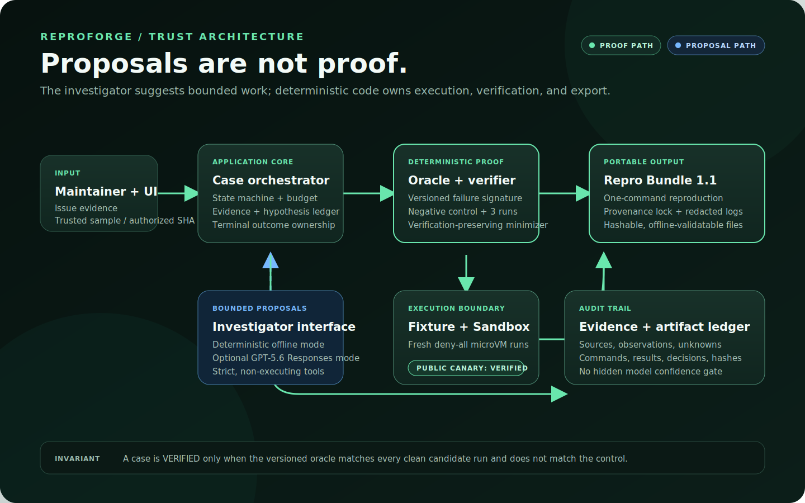
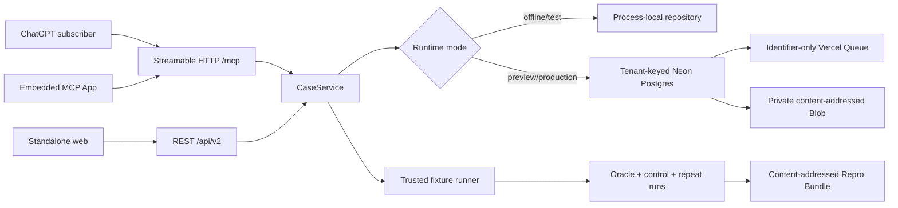

# Architecture and trust boundaries

> This page documents the implemented 0.2 trusted slice and its durable hosted
> foundation. Authentication, repository authorization, isolated external
> execution, and public hosting remain deferred in the
> [v2 specification](product-spec-v2.md).

## Design rule

GPT-5.6 may organize evidence and propose bounded experiments. It does not own execution permissions, case transitions, oracle evaluation, minimization acceptance, or the `VERIFIED` label. Those decisions remain in deterministic, schema-validated application code.

## Runtime flow

1. ChatGPT and MCP App clients call the stateless Streamable HTTP adapter at `/mcp`; the standalone browser and REST clients use their own adapters. Every path calls the same transport-neutral `CaseOperations` boundary.
2. Offline/test modes compose `CaseService` with a process-local repository and no credentials. Preview/production modes lazily compose `DurableTrustedCaseService` only after strict configuration validation.
3. A hosted start uses one serializable Postgres transaction to reserve caller-scoped idempotency, one tenant-keyed case/job, quota, audit, and an identifier-only outbox event. Exact retries return the same IDs; conflicting input fails without mutation.
4. The outbox publisher sends the opaque identity to Vercel Queue. A Postgres lease remains authoritative under duplicate delivery, restart, retry, and recovery; the queue never contains source, commands, credentials, or artifact bodies.
5. The trusted worker writes a SHA-256-addressed private Blob bundle before the terminal Postgres success transition. The job and case retain independently validated state, evidence, hypotheses, budget, and history.
6. The investigator interface selects either the deterministic offline implementation or the explicit live Responses API implementation.
7. Strict investigator tools record evidence and hypotheses. They are proposal contracts and cannot execute shell commands or modify repositories.
8. All execution crosses the runner interface. The current trusted fixture accepts one fixture ID and two allowlisted actions. The external adapter throws a typed unavailable error.
9. The pure oracle engine evaluates captured exit codes and output. The verifier requires a non-matching control and three clean matching candidates.
10. The minimizer evaluates proposed reductions with the same verifier and accepts only a reduction that remains verified. It claims local reduction, never global minimality.
11. The bundle builder redacts registered secrets, computes canonical hashes, validates lock/oracle consistency, and emits the versioned artifact set. The MCP App renders structured proof and may request read/export tools; it cannot assign a terminal state.

## Module map

| Responsibility | Implementation |
|---|---|
| Case state and transitions | `src/domain/case.ts` |
| Evidence and hypothesis contracts | `src/domain/evidence.ts` |
| Failure-oracle evaluation | `src/domain/oracle.ts` |
| Control and repeatability verification | `src/domain/verification.ts` |
| Verification-preserving reduction | `src/domain/minimization.ts` |
| Bundle hashing, redaction, and validation | `src/domain/bundle.ts` |
| Trusted and unavailable runners | `src/infrastructure/runner.ts` |
| Trusted golden-path orchestration | `src/application/sample-case.ts` |
| Case/job application boundary | `src/application/case-service.ts` and `src/application/reproduction-contracts.ts` |
| Durable trusted orchestration | `src/application/durable-trusted-case-service.ts` and `src/application/default-case-service.ts` |
| Job state and transitions | `src/domain/job.ts` |
| Process-local repository | `src/infrastructure/reproduction-repository.ts` |
| Postgres migrations and repositories | `src/infrastructure/postgres/` |
| Private content-addressed artifacts | `src/infrastructure/artifacts/` |
| Queue publisher, consumer, and recovery | `src/application/outbox-publisher.ts`, `src/application/durable-queue-consumer.ts`, and `src/infrastructure/queue/` |
| Retention, deletion, backup, and restore | `src/infrastructure/retention/` and `src/infrastructure/backup/` |
| Health and sanitized operations telemetry | `src/application/health.ts` and `src/infrastructure/operations/` |
| MCP schemas and view mapping | `src/mcp/contracts.ts` |
| MCP tool/resource registration | `src/mcp/server.ts` |
| Stateless Streamable HTTP adapter | `src/mcp/http.ts` and `src/app/mcp/route.ts` |
| Self-contained MCP App widget | `src/mcp/widget.ts` |
| Investigator implementations | `src/ai/` |
| Deterministic benchmark | `src/evaluation/` and `evals/fixtures/` |
| Browser surface and API routes | `src/app/`, including `src/app/api/v2/`, and `src/components/` |

## Data and persistence

Offline/test modes have no database or user accounts. Their cases disappear on
restart and cannot coordinate instances. Preview/production modes require a
complete hosted configuration and persist tenant-keyed state in Neon, private
content-addressed objects in Vercel Blob, and delivery intents through Vercel
Queue. Migrations are forward-only, checksum-recorded, line-ending canonical,
and safe to rerun. Postgres is authoritative for idempotency, leases, terminal
state, quota, retention, deletion, audit, and restore identity.

The current hosted tenant is still an unauthenticated public synthetic-demo
scope; durable storage does not make it safe for customer or private data.
OAuth principal/tenant resolution arrives in Milestone 8B. The optional OpenAI
transport sends only an explicit standalone investigation request with
`store: false`; the subscription-first ChatGPT/MCP path does not invoke it.

## Deployment shape

The application can run as a conventional Next.js Node process. A credential-free
build stays offline and performs no provider call. In a hosted Vercel runtime,
provider clients initialize lazily on the first operation; partial credentials
produce stable readiness failure rather than memory fallback. Local MCP
inspection uses HTTP, while ChatGPT developer mode requires an
internet-reachable HTTPS `/mcp` URL. No such production deployment is claimed
yet. Hosting the web process does not enable arbitrary repository execution.
A future external runner must be separately isolated with default-deny network,
resource limits, no ambient credentials, no host checkout mount, and a health
check that fails closed.

## Invariants

- Model confidence is never evidence of reproduction.
- Unknown or unallowlisted execution is rejected.
- Changing an oracle version invalidates earlier proof.
- A control matching the failure signature blocks verification.
- A partial candidate match is unstable, not verified.
- A Repro Bundle is usable and validatable without OpenAI access.
- A hosted job cannot succeed before its private bundle is durably readable.
- Queue delivery is a hint; Postgres identity, lease, and terminal state win.
- Missing or partial hosted configuration never degrades into process memory.

See [security](security.md), [privacy](privacy.md), and [limitations](limitations.md) for the current operating envelope.
