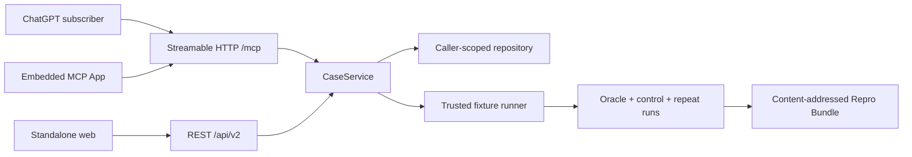

# Architecture and trust boundaries

> This page documents the implemented 0.2 trusted slice. The production target and deferred boundaries are defined in [ADR 0001](adr/0001-api-first-plugin-first.md) and the [v2 specification](product-spec-v2.md).

## Design rule

GPT-5.6 may organize evidence and propose bounded experiments. It does not own execution permissions, case transitions, oracle evaluation, minimization acceptance, or the `VERIFIED` label. Those decisions remain in deterministic, schema-validated application code.

## Runtime flow

1. ChatGPT and MCP App clients call the stateless Streamable HTTP adapter at `/mcp`; the standalone browser and REST clients use their own adapters. Every path calls the same transport-neutral `CaseService`.
2. A caller-scoped idempotency key reserves one case/job before execution so a retry cannot duplicate work. The current no-auth MCP caller scope is safe only because it contains public synthetic data.
3. The job advances from queued to running to a terminal operational state while the case orchestrator advances its separate validated state machine and retains a sourced evidence ledger, prioritized hypotheses, tool budget, and event history.
4. The investigator interface selects either the deterministic offline implementation or the explicit live Responses API implementation.
5. Strict investigator tools record evidence and hypotheses. They are proposal contracts and cannot execute shell commands or modify repositories.
6. All execution crosses the runner interface. The current trusted fixture accepts one fixture ID and two allowlisted actions. The external adapter throws a typed unavailable error.
7. The pure oracle engine evaluates captured exit codes and output. The verifier requires a non-matching control and three clean matching candidates.
8. The minimizer evaluates proposed reductions with the same verifier and accepts only a reduction that remains verified. It claims local reduction, never global minimality.
9. The bundle builder redacts registered secrets, computes canonical hashes, validates lock/oracle consistency, and emits the versioned artifact set. The MCP App renders structured proof and may request read/export tools; it cannot assign a terminal state.

## Module map

| Responsibility | Implementation |
|---|---|
| Case state and transitions | `src/domain/case.ts` |
| Evidence and hypothesis contracts | `src/domain/evidence.ts` |
| Failure-oracle evaluation | `src/domain/oracle.ts` |
| Control and repeatability verification | `src/domain/verification.ts` |
| Verification-preserving reduction | `src/domain/minimization.ts` |
| Bundle hashing, redaction, and validation | `src/domain/bundle.ts` |
| Trusted and unavailable runners | `src/infrastructure/runner.ts` |
| Trusted golden-path orchestration | `src/application/sample-case.ts` |
| Case/job application boundary | `src/application/case-service.ts` and `src/application/reproduction-contracts.ts` |
| Job state and transitions | `src/domain/job.ts` |
| Process-local repository | `src/infrastructure/reproduction-repository.ts` |
| MCP schemas and view mapping | `src/mcp/contracts.ts` |
| MCP tool/resource registration | `src/mcp/server.ts` |
| Stateless Streamable HTTP adapter | `src/mcp/http.ts` and `src/app/mcp/route.ts` |
| Self-contained MCP App widget | `src/mcp/widget.ts` |
| Investigator implementations | `src/ai/` |
| Deterministic benchmark | `src/evaluation/` and `evals/fixtures/` |
| Browser surface and API routes | `src/app/`, including `src/app/api/v2/`, and `src/components/` |

## Data and persistence

The trusted slice has no database or user accounts. Cases and jobs live in a caller-scoped in-memory repository for one server process; data disappears on restart and cannot coordinate multiple instances. The no-auth MCP route uses one anonymous trusted-sample scope and must not accept private data. A bundle is returned as validated JSON/files and downloaded by the browser or widget. The optional OpenAI transport sends only an explicit standalone investigation request and uses `store: false`; the ChatGPT/MCP journey does not invoke it.

## Deployment shape

The application can run as a conventional Next.js Node process. Local MCP inspection uses HTTP, while ChatGPT developer mode requires an internet-reachable HTTPS `/mcp` URL. Hosting the web process does not enable arbitrary repository execution. A future external runner must be a separately isolated service with default-deny network, resource limits, no ambient credentials, no host checkout mount, and a health check that fails closed.

## Invariants

- Model confidence is never evidence of reproduction.
- Unknown or unallowlisted execution is rejected.
- Changing an oracle version invalidates earlier proof.
- A control matching the failure signature blocks verification.
- A partial candidate match is unstable, not verified.
- A Repro Bundle is usable and validatable without OpenAI access.

See [security](security.md), [privacy](privacy.md), and [limitations](limitations.md) for the current operating envelope.
