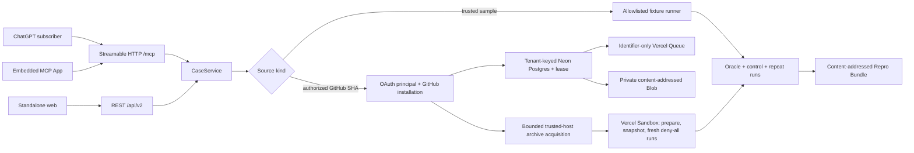

# Architecture and trust boundaries

> This page documents the implemented 0.2 trusted slice, durable hosted
> foundation, OAuth/GitHub authorization contracts, and development-provider-
> verified isolated repository runner. Live account authorization, a composed
> stable hosted journey, and public hosting remain gated in the
> [v2 specification](product-spec-v2.md).

## Design rule

GPT-5.6 may organize evidence and propose bounded experiments. It does not own execution permissions, case transitions, oracle evaluation, minimization acceptance, or the `VERIFIED` label. Those decisions remain in deterministic, schema-validated application code.

## Runtime flow

1. ChatGPT and MCP App clients call the stateless Streamable HTTP adapter at
   `/mcp`; browser and REST clients use their own adapters. The MCP contract has
   five bounded tools: trusted/repository start, authorized-repository list,
   read, cancel, and bundle export.
2. The trusted synthetic source remains no-auth and credential-free. Protected
   repository operations verify a bearer JWT, scopes, mapped principal and
   tenant, active GitHub App installation, repository membership, and an exact
   40-character commit before work can be reserved.
3. Offline/test modes compose `CaseService` with a process-local repository.
   Hosted modes use a serializable Postgres transaction for tenant-keyed
   idempotency, case/job, quota, audit, and identifier-only outbox state.
4. Vercel Queue carries only opaque identity. A Postgres lease is authoritative
   under duplicate delivery, restart, cancellation, bounded retry, and recovery.
5. For an authorized immutable source, the trusted host requests the exact
   GitHub archive, accepts only the documented temporary archive host without
   forwarding authorization, streams a bounded archive, and injects bytes into
   a fresh Vercel Sandbox. Public acquisition mints no credential.
6. Archive/profile/lockfile contracts reject traversal and unsupported input.
   Dependency preparation disables lifecycle scripts and is the only bounded
   registry phase; repository-controlled commands run only after deny-all.
7. The prepared immutable state is snapshotted. One control and three candidate
   runs each restore a fresh deny-all microVM. Wall/output/workspace/run budgets,
   cancellation, provider interruption, cleanup, and quarantine have stable
   sanitized outcomes.
8. The pure oracle requires a non-matching control and every required candidate
   to match. The bundle builder redacts, hashes, validates, and emits an
   OpenAI-independent artifact before durable terminal success.
9. The investigator interface remains separate: deterministic offline or an
   explicit Responses API adapter may propose typed experiments, but neither
   grants repository access, runs shell strings, or assigns proof status.

## Module map

| Responsibility | Implementation |
|---|---|
| Case state and transitions | `src/domain/case.ts` |
| Evidence and hypothesis contracts | `src/domain/evidence.ts` |
| Failure-oracle evaluation | `src/domain/oracle.ts` |
| Control and repeatability verification | `src/domain/verification.ts` |
| Verification-preserving reduction | `src/domain/minimization.ts` |
| Bundle hashing, redaction, and validation | `src/domain/bundle.ts` |
| Trusted fixture runner | `src/infrastructure/runner.ts` |
| Trusted golden-path orchestration | `src/application/sample-case.ts` |
| Case/job application boundary | `src/application/case-service.ts` and `src/application/reproduction-contracts.ts` |
| Durable trusted orchestration | `src/application/durable-trusted-case-service.ts` and `src/application/default-case-service.ts` |
| OAuth verification and principal mapping | `src/auth/`, `src/application/authorization.ts`, and `src/config/oauth.ts` |
| GitHub installation/repository authorization | `src/github/` and `src/application/durable-repository-case-service.ts` |
| Source, dependency, and command policy | `src/execution/github-source-acquisition.ts`, `src/execution/dependency-preparation.ts`, and `src/execution/execution-planning.ts` |
| Bounded sandbox lifecycle and proof | `src/execution/bounded-execution.ts`, `src/execution/sandbox-lifecycle.ts`, `src/execution/isolated-repository-runner.ts`, and `src/execution/repository-proof.ts` |
| Vercel Sandbox adapter | `src/execution/vercel-sandbox.ts` |
| Job state and transitions | `src/domain/job.ts` |
| Process-local repository | `src/infrastructure/reproduction-repository.ts` |
| Postgres migrations and repositories | `src/infrastructure/postgres/` |
| Private content-addressed artifacts | `src/infrastructure/artifacts/` |
| Queue publisher, consumer, and recovery | `src/application/outbox-publisher.ts`, `src/application/durable-queue-consumer.ts`, and `src/infrastructure/queue/` |
| Retention, deletion, backup, and restore | `src/infrastructure/retention/` and `src/infrastructure/backup/` |
| Health and sanitized operations telemetry | `src/application/health.ts` and `src/infrastructure/operations/` |
| MCP schemas and view mapping | `src/mcp/contracts.ts` |
| MCP tool/resource registration | `src/mcp/server.ts` |
| Stateless Streamable HTTP adapter | `src/mcp/http.ts` and `src/app/mcp/route.ts` |
| Self-contained MCP App widget | `src/mcp/widget.ts` |
| Investigator implementations | `src/ai/` |
| Deterministic benchmark | `src/evaluation/` and `evals/fixtures/` |
| Browser surface and API routes | `src/app/`, including `src/app/api/v2/`, and `src/components/` |

## Data and persistence

Offline/test modes have no database or user accounts. Their cases disappear on
restart and cannot coordinate instances. Preview/production modes require a
complete hosted configuration and persist tenant-keyed state in Neon, private
content-addressed objects in Vercel Blob, and delivery intents through Vercel
Queue. Migrations are forward-only, checksum-recorded, line-ending canonical,
and safe to rerun. Postgres is authoritative for idempotency, leases, terminal
state, quota, retention, deletion, audit, and restore identity.

The no-auth trusted sample remains an anonymous synthetic-demo scope. Protected
repository code paths implement OAuth principal/tenant resolution and
installation-scoped GitHub authorization, but live Auth0/browser/account proof
has not closed Milestone 8B. Until that gate and the composed hosted journey
pass, the durable development environment is not offered for customer or
private data. The optional OpenAI transport sends only an explicit standalone
investigation request with `store: false`; the subscription-first ChatGPT/MCP
path does not invoke it.

## Deployment shape

The application can run as a conventional Next.js Node process. A credential-free
build stays offline and performs no provider call. In a hosted Vercel runtime,
provider clients initialize lazily on the first operation; partial credentials
produce stable readiness failure rather than memory fallback. Local MCP
inspection uses HTTP, while ChatGPT developer mode requires an
internet-reachable HTTPS `/mcp` URL. The Vercel Sandbox adapter has direct
development-provider proof for bounded public source acquisition, dependency
preparation, deny-all clean runs, cancellation, output limits, snapshot
isolation, proof generation, and cleanup. It is not yet wired into a claimed
stable public service, and the default hosted `/health/runner` probe therefore
continues to fail closed until 8D composition supplies a real runner probe.

## Invariants

- Model confidence is never evidence of reproduction.
- Unknown or unallowlisted execution is rejected.
- Changing an oracle version invalidates earlier proof.
- A control matching the failure signature blocks verification.
- A partial candidate match is unstable, not verified.
- A Repro Bundle is usable and validatable without OpenAI access.
- A hosted job cannot succeed before its private bundle is durably readable.
- Queue delivery is a hint; Postgres identity, lease, and terminal state win.
- Missing or partial hosted configuration never degrades into process memory.
- GitHub authorization is never forwarded to a temporary archive URL or placed
  in a sandbox, command, log, artifact, or bundle.
- Repository-controlled code runs only in disposable deny-all sandboxes, never
  in the trusted host process.
- Every control/candidate run starts from a fresh immutable snapshot, and
  cleanup failure is quarantined without changing proof truth.

See [security](security.md), [privacy](privacy.md), and [limitations](limitations.md) for the current operating envelope.
