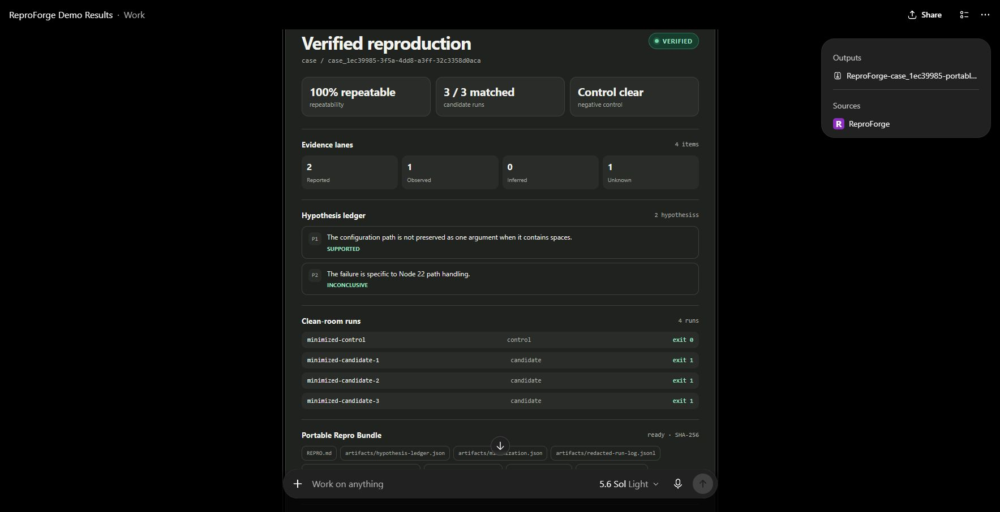
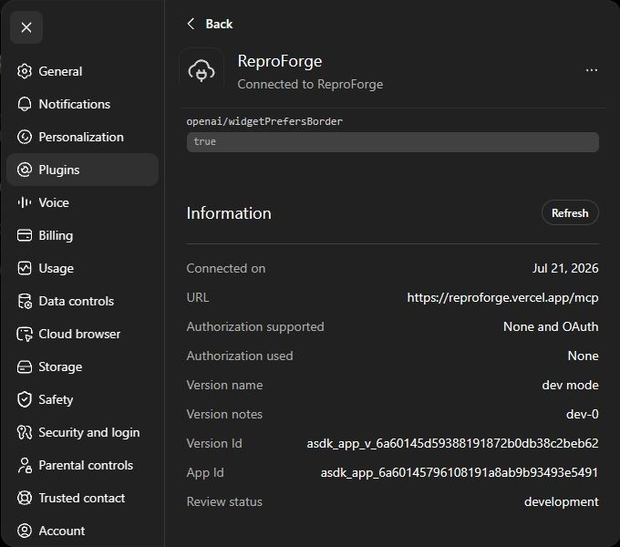
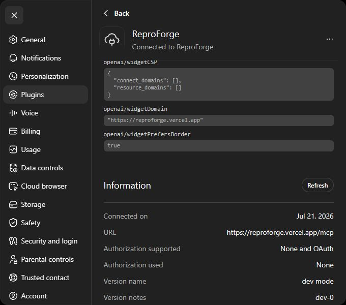

# ChatGPT-host trusted demonstration

**Caption:** The keyless trusted demonstration completed inside ChatGPT Work
through the production ReproForge MCP app. No ReproForge account or user API
key was used.

## Hosted result

The exact review prompt was:

> Run the ReproForge trusted demonstration, show me the machine-verified
> evidence, and export the portable Repro Bundle.

ChatGPT invoked `start_reproduction` and then `export_repro_bundle`. The trusted
fixture completes synchronously, so a polling call is unnecessary. ChatGPT
made one additional idempotent export read while materializing the downloadable
ZIP; that host packaging behavior does not alter the canonical app sequence or
case state.

The hosted case `case_1ec39985-3f5a-4dd8-a3ff-32c3358d0aca` reached
`VERIFIED`: all three candidate runs matched, the control stayed clear, and
repeatability was `1.0`. The evidence supports the cause that a path containing
spaces was not preserved as one argument. The separate Node 22 hypothesis
remained explicitly inconclusive. The canonical ReproForge bundle hash is
`8f0e387c9031c1829dac57a36c03e6791e493e6fe7179c4ac0ed2f57bb9b0090`.
ChatGPT also produced the durable download
`ReproForge-case_1ec39985-portable-repro-bundle.zip`, whose SHA-256 is
`fd43e1049087147320a93e08149d0d64cbdc0ce52a9d63221b5e4f2d1813017a`.
The archive contains the eight files declared by the app's bundle contract.

## Anonymous connection and submission metadata

The developer-mode app is connected to
`https://reproforge.vercel.app/mcp`. ChatGPT reports authorization support as
`None and OAuth` and reports the active trusted-demo connection as `None`.
Judges can therefore run the trusted demonstration with a ChatGPT subscription
without creating a ReproForge account, linking GitHub, or supplying an OpenAI
API key. OAuth remains available only for the protected repository workflow.

After production deployment `dpl_YsGFHb4q5o1dAnZAwTnFHnAcenc6`, ChatGPT's
Refresh action completed successfully and displayed both `ui.domain` and
`openai/widgetDomain` as `https://reproforge.vercel.app`. The previous missing
widget-domain submission warning disappeared.

The repository-local Codex wrapper under `plugins/reproforge` binds the same
evidenced app ID. It passes the canonical plugin validator and a unit contract
that fails if the wrapper drifts from this host gate. It is portable packaging,
not a marketplace installation or publication claim.

The machine-readable [host gate](chatgpt-host-gate.json) and [capture
manifest](manifest.json) retain the app/version IDs, exact case and hashes,
deployment revisions, image checksums, and scope boundary.

## Provenance and sanitization

These are real first-party screenshots from ChatGPT, not a local preview,
mockup, or generated image. The images intentionally exclude the ChatGPT
sidebar, profile, conversation history, account identity, email, cookies,
credentials, private repositories, provider IDs, and customer data. They show
only the ReproForge app result and sanitized developer-mode connection
metadata.

This record passes the `positive-trusted-demo` review case. It does not claim
that the seven protected, private, intermittent, or negative hosted review
cases have been exercised; those remain `pending_hosted` in the review pack.
