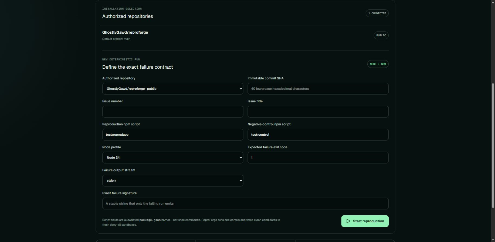

# Production GitHub authorization evidence

**Caption:** Live ReproForge production catalog after the read-only GitHub App
was installed for only `GhostlyGawd/reproforge` and the signed callback returned
to `/repositories?github=connected`.

## Capture record

- Captured: `2026-07-21T23:29:27.2268378Z`
- Source commit: `feae27222a64cd0131f0f7f4fb8d262d546d3cb0`
- Production deployment: `dpl_J75awz1GGu5QAEb91Hbxgq2fr64o`
- Stable origin: `https://reproforge.vercel.app`
- Route: `/repositories?github=connected`
- Capture method: first-party signed-in Chrome session, scrolled to the
  repository catalog before a viewport screenshot
- Image: JPEG, 1834 × 899, 64,977 bytes
- SHA-256: `a89c044e9087bb7e2e80ccf0567470eb498e2c5a5097d1d8dd5846e8d71fec2e`

## Verified result

The production page reported `1 connected`, listed exactly
`GhostlyGawd/reproforge`, and exposed the bounded deterministic-run contract.
The preceding installation request reached GitHub's App permissions screen,
selected only this repository, and returned through ReproForge's signed
installation callback.

## Provenance and sanitization

This is a real first-party production capture, not generated imagery or a
mockup. The viewport intentionally excludes the signed-in identity card. It
contains only a public repository name and product-controlled empty/default
form values; it contains no email address, account profile, cookie, credential,
private repository, provider resource ID, customer data, or private source
content.

This artifact proves installation and catalog authorization. It does not by
itself prove a completed repository reproduction or ChatGPT-host interaction;
those require separate end-to-end evidence.
