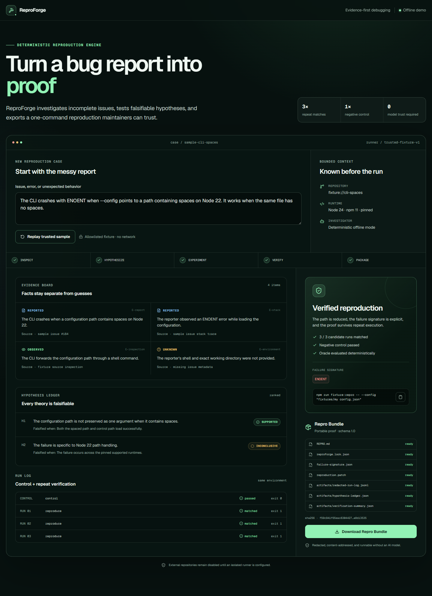
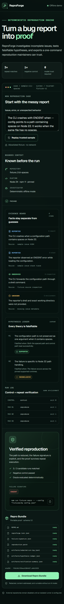

# Milestone 2 — golden-path product evidence

Captured on 2026-07-19 at 2026-07-19T17:01:38Z from source commit
`d15d0c953d9087d63923db28afc8600a65ce6772`.

## Outcome

The production application accepts the bundled issue, runs the trusted offline journey, separates evidence from hypotheses, shows control-plus-three-run verification, and exposes a downloadable, content-addressed Repro Bundle. The same interface also supports honest `UNSTABLE`, `NOT_REPRODUCED`, and `BLOCKED` terminal presentations and an explicit cancelled state.

## Verification record

| Boundary | Result | Evidence |
| --- | --- | --- |
| Production page | Passed | Title and meaningful content rendered; no framework error overlay |
| Golden path | Passed | `Verified reproduction`, 3 / 3 candidate matches, and passing negative control rendered |
| Bundle API | Passed | HTTP success, attachment name, 64-character bundle hash, and required `REPRO.md` |
| Accessibility | Passed | Axe reported zero automatically detectable violations |
| Keyboard | Passed | Issue and run controls received visible focus; Enter completed the flow |
| Cancellation | Passed | In-flight run stopped while preserving the issue |
| Reduced motion | Passed | Complete proof rendered in 653 ms with reduced motion requested |
| Responsive layout | Passed | Desktop and 390px mobile viewports had no horizontal overflow |
| Browser console | Passed | Zero console messages and zero page errors in the production capture |

The executable scenarios are in [`e2e/golden-path.spec.ts`](../../../e2e/golden-path.spec.ts). Exact machine-readable capture metadata and checksums are in [`manifest.json`](manifest.json).

The final `npm run verify` gate passed with 27 unit/property tests, 6 BDD scenarios and 28 steps, 7 browser journeys, strict type-checking, linting, and a production build. `npm audit --audit-level=high` reported 0 vulnerabilities.

## Desktop — complete verified proof

At 1440 × 1000 viewport size, the complete proof keeps the investigation ledger and final bundle visible as a single auditable workspace.

## Mobile — same proof, one column

At 390 × 844 viewport size, the full workspace reflows without removing evidence or overflowing horizontally.

## Capture and provenance

- Captured with `agent-browser` 0.32.2 using Chrome 151 against `npm run start` after a successful Next.js production build.
- Screenshots show the real locally rendered application state, not concept art or an image-generation output.
- All case content comes from the synthetic, bundled `fixture://cli-spaces` sample. No credentials, private repositories, personal data, or user-provided content appear.
- The UI and source shown are original work in `GhostlyGawd/reproforge`; Lucide icons are rendered by the declared `lucide-react` dependency.
