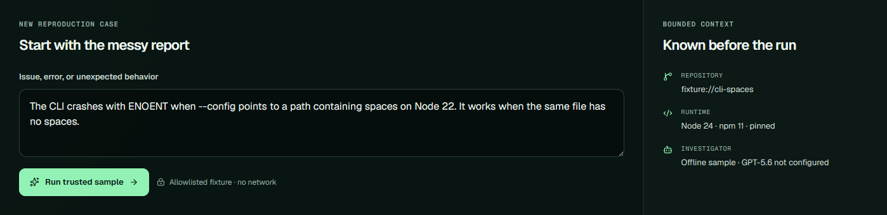

# Milestone 3 — GPT-5.6 boundary evidence

Captured on 2026-07-19 at 2026-07-19T17:19:31Z from source commit
`00f19f55d0ff641dc8dd3875258a2653ede2e80c`.

## Outcome

ReproForge now has two explicit investigator implementations behind the same typed interface:

- a deterministic offline investigator that needs no credentials or network; and
- a lazy live adapter for `gpt-5.6-sol` using the Responses API with medium reasoning.

The UI keeps the sample in offline mode and separately reports whether the live adapter is configured. The API defaults to offline and returns HTTP 503 when live mode is explicitly requested without `OPENAI_API_KEY`.

## Contract evidence

| Contract | Result |
| --- | --- |
| Model and API | `gpt-5.6-sol` through Responses |
| Reasoning and output | `medium` reasoning, `low` text verbosity, 1,800-token output ceiling |
| Data handling | `store: false`; full output items preserved during tool continuation |
| Tool surface | 3 strict record/proposal tools; no arbitrary execution or publication capability |
| Application budget | 1–12 calls, default 6; excess calls fail closed |
| Lazy initialization | Client factory remains untouched until the first explicit live request |
| Offline property suite | Deterministic and within budget across 150 generated inputs |
| Recorded contract | Sanitized two-turn fixture completes without a key or network |
| API contract | Offline success, strict-input rejection, and missing-key 503 all pass |
| Full local gate | 38 unit/property tests, 6 BDD scenarios / 28 steps, 8 browser journeys, type, lint, and production build |
| Dependency audit | 0 vulnerabilities |
| Live smoke | Skipped because `OPENAI_API_KEY` was absent |

The implementation choices and official references are documented in [`docs/openai-integration.md`](../../openai-integration.md).

## Truthful offline state

The screenshot is cropped to the real issue-intake element so the mode and permission boundary remain legible.

## Capture and provenance

- Captured with `agent-browser` 0.32.2 using Chrome 151 against `npm run start` after a successful Next.js production build.
- Screenshot selector: `.intake`; browser viewport: 1440 × 1000.
- The screenshot shows the real locally rendered application state, not concept art or generated imagery.
- All visible case data is synthetic and comes from `fixture://cli-spaces`. No API key, credentials, personal data, or private repository content is visible.
- The UI and source are original work in `GhostlyGawd/reproforge`; icons are rendered by the declared `lucide-react` dependency.
