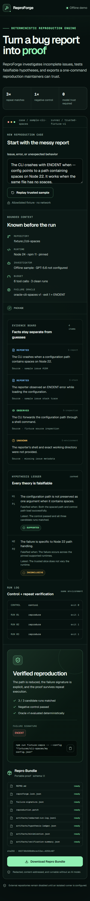

# Milestone 4 — completion evidence

Captured on 2026-07-19 at 2026-07-19T17:49:46Z from source commit `c5f1107ce31f0dfb6ed5910545204fc59e3bbed3`.

## Outcome

The trusted-fixture MVP now closes the issue-to-proof loop with a runnable failing fixture, a versioned oracle, negative control, three clean candidate runs, verification-preserving minimization, provenance-rich Bundle 1.1 output, deterministic evaluations, CI, and public product documentation.

## Verification record

| Boundary | Result | Evidence |
|---|---|---|
| Direct reproduction | Passed | Spaced-path command exited `1` with `ENOENT`; control command exited `0` and loaded its config. |
| Deterministic core | Passed | 46 unit/property tests across 16 files, including 250 generated minimization cases. |
| Observable outcomes | Passed | 7 BDD scenarios / 32 steps for verified, unstable, not-reproduced, blocked, stale-oracle, bundle, and over-reduction behavior. |
| Production browser | Passed | 8 Playwright journeys; desktop/mobile, bundle API, offline API, cancellation, keyboard, reduced motion, and Axe. |
| Accessibility | Passed | Axe returned zero automatically detectable violations on the verified result. |
| Evaluation | Passed | 4 / 4 expected statuses, zero false positives, zero false negatives, and `1.0` bundle completeness. |
| Production capture | Passed | Budget and oracle visible; 3 / 3 candidates matched; control passed; Bundle 1.1 lists all eight files. |
| Browser runtime | Passed | Zero page errors and zero console messages in production Chrome 151. |
| Supply chain | Passed | `npm audit --audit-level=high` reported zero vulnerabilities. |
| Documentation | Passed | Architecture rendered and parsed as XML; local Markdown targets resolved; limitations and release truth are explicit. |
| Live GPT smoke | Skipped | No `OPENAI_API_KEY` was present; recorded transport contracts and the offline journey are the committed evidence. |

The exact evaluator output is committed as [`eval-report.json`](eval-report.json). The implementation-to-requirement mapping is in the [completion audit](../../completion-audit.md), and capture metadata is in [`manifest.json`](manifest.json).

## Desktop — complete proof workspace

At a 1440 × 1000 viewport, the full proof is visible as one auditable workspace: source evidence and hypotheses remain distinct while the terminal result and portable output stay alongside them.

## Mobile — same evidence, one column

At a 390 × 844 viewport, the interface preserves the issue, bounded context, evidence, hypothesis history, run log, verified result, and every bundle file without removing proof to fit the screen.

## Architecture evidence

The original SVG was rendered in headless Chrome at 1440 × 900 and inspected before commit. It has an accessible title and description and is the fallback image for environments that do not render the architecture guide's Markdown context.

## Capture and provenance

- Captured with `agent-browser` 0.32.2 using headless Chrome 151 against `npm run start` after a successful Next.js production build.
- Screenshots show the real local application state from the recorded commit, not concept art or generated imagery.
- All case data comes from the synthetic `fixture://cli-spaces` sample. No credentials, private repositories, personal data, or user-provided content appears.
- The UI, fixture, documentation, and architecture are original work in `GhostlyGawd/reproforge`; Lucide icons are rendered by the declared `lucide-react` dependency.
