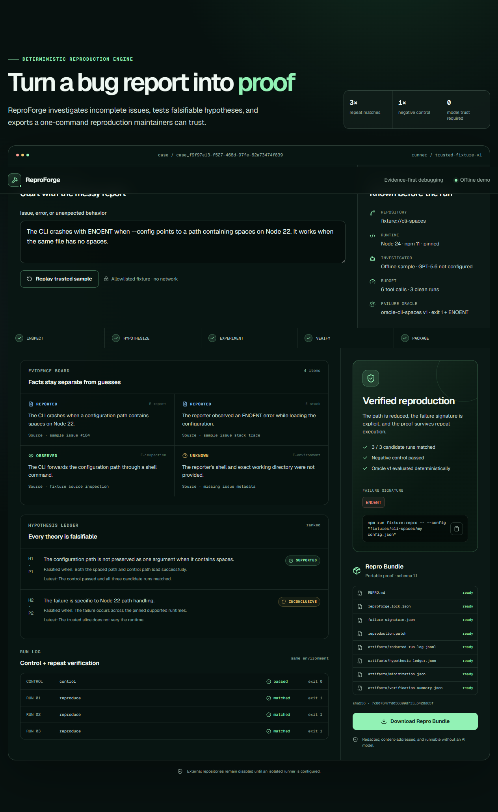

# Milestone 6 — headless case and job service evidence

Captured on 2026-07-19 from implementation commit `869f3d9e3bfb29b828351387f3b362b30fad3a8c`.

## Outcome

The trusted reproduction now runs behind one transport-neutral `CaseService`. The browser, legacy sample download, and REST v2 adapters share the same job, case, proof, and bundle behavior. Caller-scoped idempotency prevents duplicate execution, changed input under a reused key conflicts, reads do not cross caller boundaries, job failures are sanitized, and the complete path succeeds with `OPENAI_API_KEY` absent.

## TDD record

The first focused run was intentionally red:

```text
npm test -- --run tests/case-service.test.ts tests/case-service.property.test.ts tests/reproduction-route.test.ts

Test Files  3 failed (3)
Tests       no tests
Cause       the case-service, repository, job, and REST route modules did not exist
```

After the smallest complete implementation, the focused suite passed. The final milestone gate recorded:

| Boundary | Result |
|---|---|
| Unit and property | 61 tests across 19 files; 100 generated idempotency cases, 100 terminal-job transitions, and 100 repeatability-policy cases |
| Executable BDD | 10 scenarios / 55 steps, including keyless idempotent start, ownership-safe lookup, and changed-input conflict |
| REST v2 | First start `201`; identical retry `200` with `reused: true`; case `VERIFIED`; job `SUCCEEDED`; bundle 1.1 with 8 files |
| Browser | 9 Playwright journeys, including live start/retry/read/poll/export through REST v2 |
| Accessibility | 0 automatically detectable Axe violations on the verified result |
| Production | Strict typecheck, lint, Next.js build, and all four REST v2 routes passed |
| Browser runtime | Meaningful content, no framework error overlay, no console messages, and no page errors |

The sanitized live HTTP record is committed as [`api-contract.json`](api-contract.json). Exact test, capture, and provenance metadata is in [`manifest.json`](manifest.json).

## Service-backed browser journey



The visible `case_...` identifier comes from `CaseService`, while the final proof still requires the existing oracle, negative control, and three clean matches. The rendering did not bypass the service with a direct fixture call.

## Scope truth

This evidence proves one process-local, synthetic, no-auth vertical slice. The repository is in-memory and does not survive restart; it is not multi-instance storage. External repositories remain rejected because no isolated runner exists. ChatGPT/MCP transport, durable persistence, OAuth, production hosting, and plugin submission remain later milestones.

## Capture and provenance

- Captured at 1264 × 569 with `agent-browser` 0.32.2 against `npm run start` after a successful production build; the committed PNG is a full-page 1264 × 2061 capture.
- The screenshot and HTTP transcript show real application output from the recorded implementation commit.
- All content comes from `fixture://cli-spaces`; no credentials, API keys, private source, personal data, or user content appears.
- The UI, service, fixture, and documentation are original ReproForge work; Lucide icons come from the declared `lucide-react` dependency.
