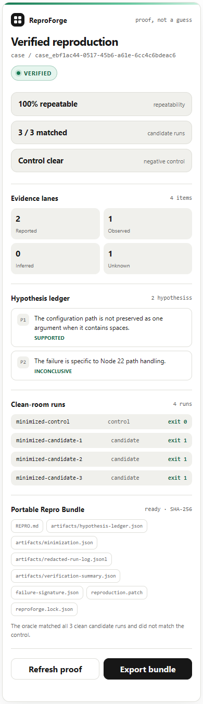

# Milestone 7 — ChatGPT MCP app evidence

Captured on 2026-07-19 from implementation commit
`643da49c4480de80f2f78c1143ac1628097f21d6`.

## Outcome

ReproForge now exposes the complete trusted reproduction through a stateless
Streamable HTTP MCP endpoint and an embedded MCP App. A ChatGPT host can start,
retry, read, and export a machine-verified case without a user OpenAI API key.
Exactly three tools are exposed; none accepts a repository URL, arbitrary
command, customer code, or credential. The widget renders the same structured
proof and can refresh or export through the standard MCP Apps bridge.

## TDD and protocol record

The focused suite was intentionally red before implementation:

```text
npm test -- --run tests/mcp-server.test.ts tests/mcp-http.test.ts tests/widget.property.test.ts

Test Files  3 failed (3)
Cause       the MCP server, HTTP adapter, and widget modules did not exist
```

The focused green run passed 9 tests across 3 files. The milestone gate then
recorded:

| Boundary | Result |
|---|---|
| Unit and property | 70 tests across 22 files; 100 generated hostile widget payloads plus the existing proof/idempotency properties |
| Executable BDD | 13 scenarios / 73 steps, including discovery, closed inputs, keyless retry, proof, widget MIME, and CSP |
| MCP | initialize, list, resource read, start, retry, get, export, and sanitized errors passed with official TypeScript SDK clients |
| Live Next route | Streamable HTTP initialization/discovery/start passed through the production `/mcp` route |
| Independent Inspector | official `@modelcontextprotocol/inspector` 1.0.0 `tools/list` completed with exit 0 and found exactly three tools |
| Evaluation corpus | 4/4 positive, negative, unstable, and misleading-control cases passed; zero false positives or false negatives |
| Browser | 16 Playwright journeys; widget desktop/narrow/200%-zoom/keyboard behavior and actual MCP route included |
| Accessibility | 0 automatically detectable Axe violations in the proof widget |
| Production | lint, strict typecheck, Next.js build, and route generation passed |
| Browser runtime | meaningful content, no framework error overlay, no page errors, and no horizontal overflow |

The sanitized machine record is
[`protocol-transcript.json`](protocol-transcript.json). Exact test, capture, and
provenance metadata is in [`manifest.json`](manifest.json).

## Actual MCP App resource


The desktop capture is the same self-contained HTML returned at
`ui://reproforge/proof-v1.html`, injected with a real trusted-service result by
the `/widget-preview` evidence harness.



The narrow capture verifies the complete evidence hierarchy and bundle controls
at 390 pixels without omitting proof fields.

## Scope truth and account gate

This evidence proves the code-complete, local trusted-sample app boundary. It
does not prove a hosted or published plugin. ChatGPT developer mode requires a
reachable HTTPS MCP URL, and local plugin packaging requires the real
`plugin_asdk_app…` ID created in the owner's account. Neither existed during
this milestone, so no fake ID, ChatGPT-host screenshot, public submission, or
publication claim is present. Those exact steps are documented in the
[ChatGPT app and plugin guide](../../chatgpt-plugin.md).

The endpoint is no-auth only because every input and output is synthetic. State
is process-local, all anonymous callers share the trusted-demo scope, and no
external repository can execute. OAuth, tenant isolation, durable persistence,
managed sandboxing, quotas, and operations remain Milestone 8.

## Capture and provenance

- Captured with `agent-browser` 0.32.2 against `npm run start` after a successful production build.
- Dark desktop: 1440-pixel viewport, full-page 1440 × 1024 PNG.
- Light narrow: 390-pixel viewport, full-page 390 × 1353 PNG.
- Both images show real rendered ReproForge application state from the recorded implementation commit.
- All content comes from `fixture://cli-spaces`; no credentials, private source, personal data, or user content appears.
