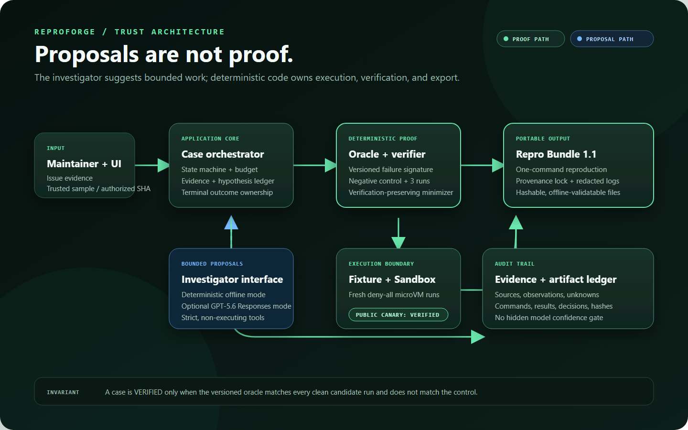

# Milestone 8C — isolated execution evidence

This directory records the sanitized provider proof for ReproForge's isolated
repository runner. The machine-readable summary is
[`manifest.json`](manifest.json), and the independently validatable public
canary output is [`public-canary-bundle.json`](public-canary-bundle.json). This
evidence closes the 8C implementation boundary; live account authorization and
the hosted product journey remain separate 8B/8D gates.

## Verified provider boundary

| Gate | Observed result |
|---|---|
| Trusted-host acquisition boundary | GitHub public source `GhostlyGawd/reproforge` at immutable commit `fd4c4be62d37fd76167c3b9a71d64c979f33e28e` returned a documented temporary archive redirect; the response was streamed under the 100 MiB limit. |
| Credential boundary | Authorization applies only to the fixed `api.github.com` archive request and is not forwarded to `codeload.github.com`; only compressed bytes cross into the sandbox. |
| Sandbox source integrity | The host SHA-256 matched `sha256sum` inside a real Vercel Sandbox and the archive was readable by `tar`. |
| Network isolation | The sandbox was deny-all before upload; an attempted GitHub request failed and the policy never opened for source acquisition or execution. |
| Observable secret surfaces | Process environment, arguments, Git configuration, and workspace file names contained no synthetic acquisition secret, `GITHUB_TOKEN`, or `VERCEL_OIDC_TOKEN`. |
| Output budget | A 3 MiB stream retained the configured 1 MiB per-stream share of the 2 MiB aggregate budget while preserving the original byte count and full SHA-256. |
| Cancellation | Aborting an active infinite process returned the stable `PROVIDER_INTERRUPTED` boundary and did not leave the provider test running. |
| Fresh isolation | Two microVMs restored from one prepared snapshot; both saw the immutable marker and neither inherited the first restore's mutation. |
| Cleanup | Both restores and the source snapshot were deleted; no quarantine record was required. |
| Full public canary | Exact revision `804d2da174060b40981e6a0437e6b212fc64d36d` completed one control and three candidates in four fresh deny-all microVMs, produced `VERIFIED`, emitted a valid portable bundle, and cleaned every resource. Public acquisition did not mint a GitHub credential. |
| Durable providers | The same gate also passed six live Neon, private Blob, Queue, concurrency, restore, and cleanup tests. |

The direct command was `npm run test:providers`: 9 tests passed, 0 failed, and
0 skipped (3 isolated and 6 durable-provider tests). Provider resource names,
session IDs, database identifiers, object
keys, URLs, headers, credentials, and response bodies are deliberately omitted.

`npm run test:bdd` passed all 39 scenarios and 283 steps, including the 13
repository-specific source, dependency, execution, outcome, cancellation,
provider-loss, and secret-safety scenarios. The focused lifecycle/durable suite
passed 16 tests.

The complete local gate covers 341 passing Vitest tests (with only the 9
credential-gated live-provider cases skipped in the offline run), 39/39 BDD
scenarios, 110 documentation links, a production Next.js build, five-tool
keyless MCP smoke, 4/4 deterministic eval fixtures, and 18/18 Chromium browser,
responsive, reduced-motion, keyboard, and accessibility journeys. The same 9
provider cases pass separately through `npm run test:providers`.

## Public canary bundle

The committed evidence file is 11,187 bytes with outer SHA-256
`7d6908cfe7a2f34916b739fbde0c46ec71d5dab7872bbcfbc37b7d6ea10eb52f`.
It records the exact source revision, Node/npm and policy provenance, a
non-matching control, three matching candidates, content hashes, and all eight
portable bundle files. `npm run evidence:public-canary` regenerates it against
the real development Sandbox provider.

A post-generation scan found no synthetic canary secret, `GITHUB_TOKEN`,
`VERCEL_OIDC_TOKEN`, provider resource prefix, sandbox/snapshot identifier,
local Windows path, or provider URL. The artifact contains only public
synthetic fixture content.

## Visual documentation

The current first-party architecture SVG was rendered with Playwright Chromium
at 1440 × 900 on 2026-07-20 and visually inspected for complete labels and flow.
The 327,565-byte PNG has SHA-256
`fdd3271480fad66f5305e91d2b4f44c113e38f6e279719098d8714fb6494ff62`.
It contains no external product capture, private data, or generated imagery;
the exact source commit is recorded in the manifest.

## Red-to-green provider findings

The first canary rejected Vercel's secure header transformation because that
feature is unavailable on the project's Hobby plan. The runner was redesigned
to download a bounded compressed archive in the trusted application host and
inject only bytes into a sandbox that remains deny-all. This removes the paid
plan dependency and strengthens the credential boundary.

The next canary found that Vercel rejects `mkdir` when a prior experiment's
trusted supervisor directory already exists. A failing local contract test now
models that behavior, and every run receives a unique trusted-supervisor
directory. The repeated live gate then passed all nine tests.

The first aggregate browser run also exposed a one-second reduced-motion race:
five nominal 1 ms React effect cycles could exceed the assertion deadline under
four-worker load. The corrected UI skips the staged animation as one direct
state transition when reduced motion is requested. The scenario passed five
consecutive focused repetitions and then the complete 18-test browser suite.

The next aggregate run showed that the heaviest 500-case adversarial property
could exceed Vitest's generic 5-second per-test default under load even though
no generated assertion failed. Its generated depth and assertions are
unchanged; the test now declares a bounded 30-second harness timeout. The full
four-property file then passed three consecutive focused runs.

The following full-chain browser stage exposed development-server compilation
contention: four unrelated REST, MCP, and repository tests reached the shared
30-second ceiling while the page that had loaded showed the correct state. The
release gate now exercises the already-built production server on dedicated
port 3129; direct `npm run test:browser` remains self-contained by building
first. All 18 journeys passed that production path in 15.5 seconds without
loosening any assertion or timeout.

## Evidence boundary

This is backend evidence, so a product screenshot would add no meaningful proof. Its
observable contract is provider behavior, byte/hash identity, network denial,
bounded output, cancellation, fresh-state behavior, cleanup, and a portable
machine-readable bundle. The updated architecture diagram documents the trust
boundary; hosted browser and ChatGPT visuals remain required by 8D/9.
