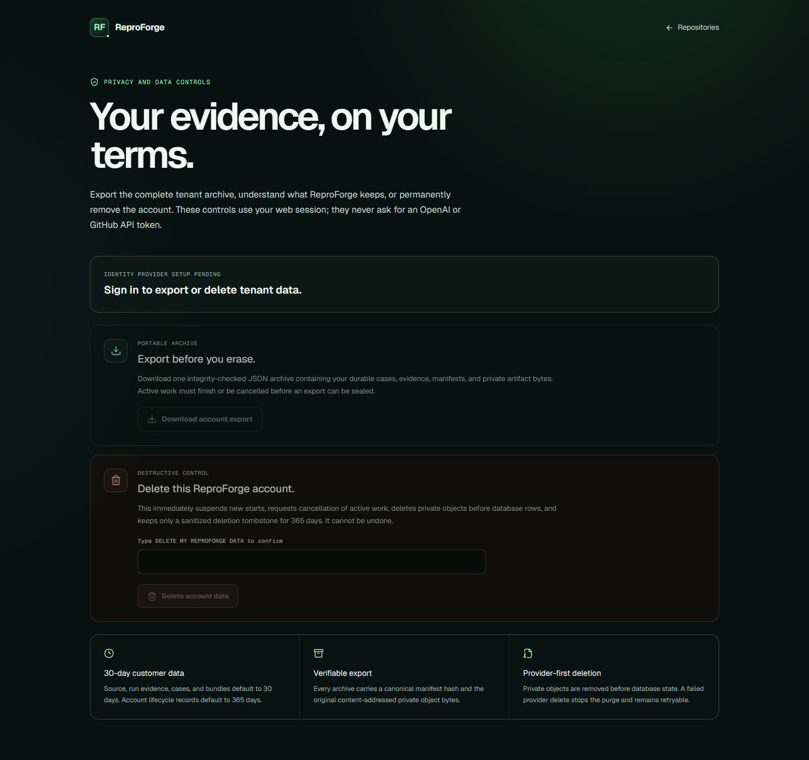
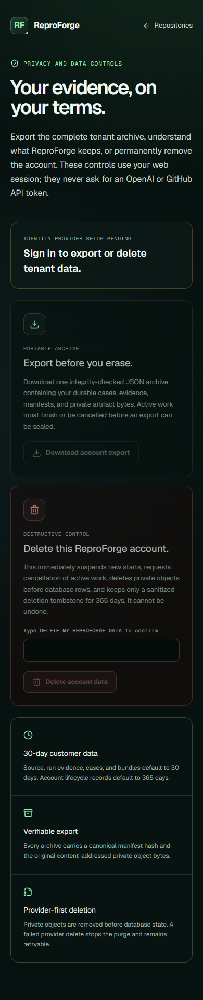
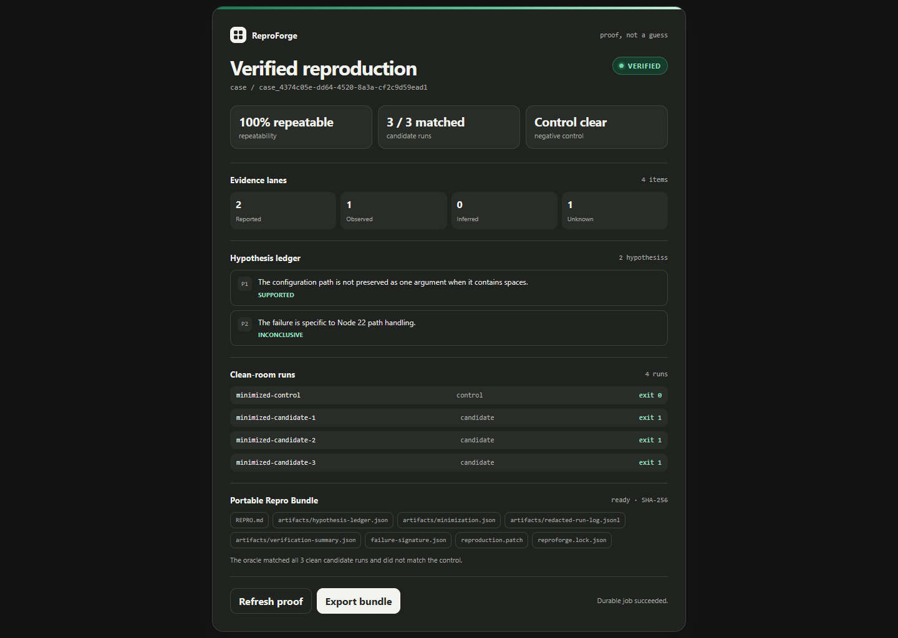
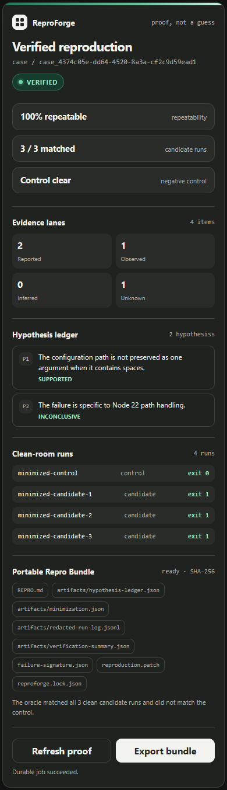
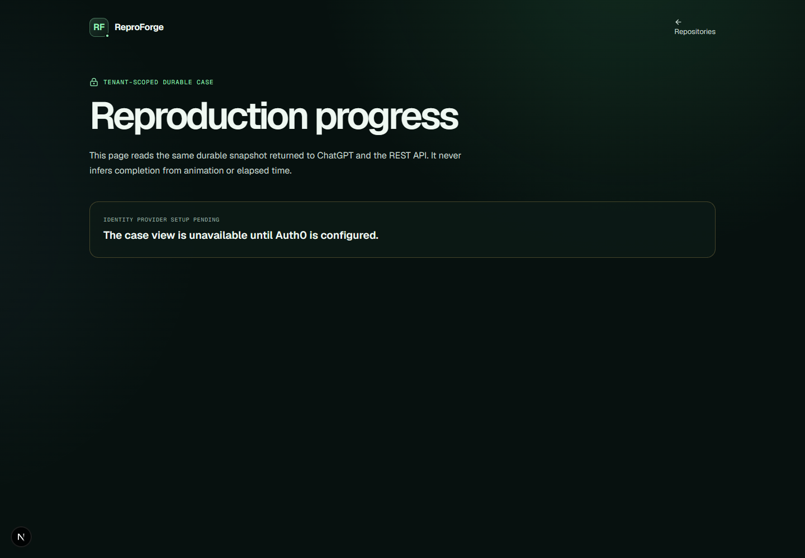
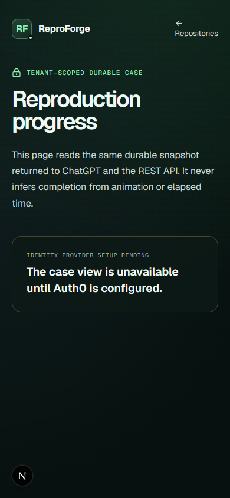

# Milestone 8D evidence

This directory holds sanitized local and hosted evidence for private-beta
completion. Local screenshots prove responsive rendering and accessibility
structure only; they do not substitute for the public/private deployed canary
or live provider gates required by the milestone specification.

Evidence is added incrementally and tied to an exact Git commit in
`manifest.json` before Milestone 8D can be marked complete.

## Current verified slice

Exact implementation commit
`370db06247ad8fa80714de2ca7015cb86f453919` adds a real isolated-runner
capability probe, fail-closed validation of the complete hosted product
configuration, one durable progress projection shared by REST, MCP, ChatGPT
widget, and tenant-scoped web views, resilient worker/operator controls, and
the account data lifecycle.

The RF-8403 slice blocks new starts during runner degradation while preserving
reads, recovers expired leases, observes cancellation before the next command,
and exposes production-only outbox, lease, and exact-resource quarantine
operations. Its focused resilience gate passed 29 tests, including 500 hostile
operator argument cases.

The RF-8404 slice adds integrity-checked portable account archives,
tenant-scoped export quota, authenticated export and deletion routes, explicit
destructive confirmation, provider-first deletion, retryable retention, and
operator backup/restore commands. Its focused gate passed 17 tests. The broader
governance suite passed 25 tests, including 250 generated retention/deletion
sequences; the backup suite passed 14 tests, including 500 generated portable
archive round trips and mutations.

At this commit, Cucumber passed 45 scenarios and 326 steps, the account page
passed 3 browser tests, TypeScript and ESLint passed, and the production Next.js
build completed. Production-build browser inspection found no framework error
overlay, page errors, console output, or horizontal overflow at a 390 × 844
mobile viewport. The final local account page deliberately shows real controls
disabled while identity configuration is absent.

## Local visual evidence

These captures intentionally prove only the local widget presentation,
responsive layout, fail-closed account boundary, and disclosed account-data
controls. They are not proof of a live export or deletion, Auth0, GitHub App,
hosted ChatGPT, or public/private canary journey. Those gates remain open and
keep the milestone status `in-progress`.
