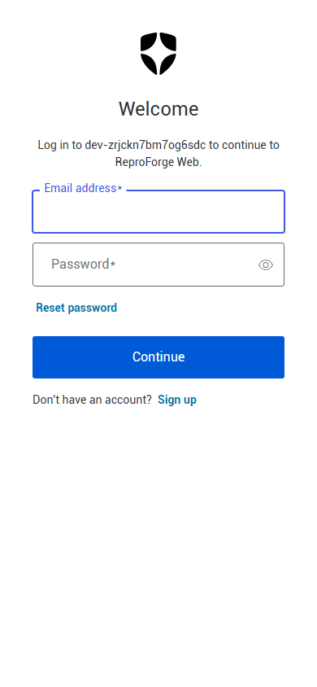

# Milestone 9 hosted public-boundary evidence

This partial milestone record proves the public production boundary at
`891749b4fcce7faabf6424b565cdc45a6eb3cd3a`. GitHub's full verification gate
passed, Vercel promoted the exact preview to production deployment
`dpl_2KwXZ88yZE1fPTa9wXomJKwPiBdm`, and the stable origin was verified after
promotion.

The machine-readable [hosted boundary report](hosted-boundary-report.json)
records public route status, the closed domain-challenge response, selected
security-header assertions, and keyless MCP initialization. The challenge
route returned an empty `404` with `no-store`; it does not expose a placeholder
or verification token when no real challenge is active.

## Production visual evidence

The desktop and mobile images are real first-party captures from
`https://reproforge.vercel.app`, not generated mockups. Their exact route,
viewport, byte count, SHA-256 digest, caption, alt text, capture time, and
sanitization statement are recorded in [the manifest](manifest.json). The
built Playwright run passed all 26 browser checks, including five public-policy
checks and zero automated accessibility violations.

## Production MCP regression gate

After the visual capture, commit
`eee99411be91c05225ac0d5d95a9997ab01af068` fixed and regression-tested
decoded private-Blob reads. GitHub CI passed on the exact commit, and Vercel
promoted it as production deployment `dpl_HvTttjPzKFuYR68z45eLyeTF2Xir`.

The sanitized [production MCP gate](production-mcp-gate.json) records an
official MCP SDK run against the stable production origin. Tool discovery,
verified start, idempotent retry, durable read, matching-hash bundle export,
and `REPRO.md` presence all passed. Strict schemas also rejected arbitrary
source/command and destructive/fabricated-proof inputs, while an unknown case
was rejected or challenged. All nine live provider tests passed separately.

This protocol evidence is not presented as ChatGPT-host evidence. The later
[ChatGPT host record](../chatgpt-host/README.md) independently exercises the
trusted review prompt inside ChatGPT and closes that case.

## Intermittent canary provider gate

The public synthetic
[intermittent canary](https://github.com/GhostlyGawd/reproforge-intermittent-canary)
is pinned at `61a9fbfe6bf2e2f8c00f2f55b142dafd810b99be`. Its
[provider report](intermittent-canary-gate.json) records the real isolated
runner result: two of three candidates matched, the control remained clear,
the outcome was `UNSTABLE`, no bundle or files were created, cleanup was clean,
and no resource entered quarantine.

The corresponding review case remains pending until the repository is selected
through the GitHub App and the production flow is exercised through ChatGPT.

## Hosted load and latency gate

The [hosted load report](hosted-load-gate.json) separates the configured
private-beta capacity from a larger burst. At the configured three-active-job
limit, same-idempotency start p95 was 501.02 ms, the eventual read was 96.71
ms, no request failed, every retry shared one case/job identity, and the case
became `VERIFIED`. Both documented latency targets passed.

At 16 simultaneous duplicate starts, correctness and availability still held,
but start p95 rose to 2716.84 ms and missed the 2000 ms target. The report
retains that failed threshold as a capacity boundary; ReproForge does not claim
sub-two-second start latency above its configured private-beta limit.

## Signed-in GitHub App and production public canary

The later [production public-canary record](../production-public-canary/README.md)
proves the composed signed-in path. The read-only GitHub App catalog contained
exactly the two selected public repositories, and the lightweight canary ran at
its immutable failing commit through the live queue, private object store, and
deny-all Vercel Sandbox runner. The first durable attempt reached `VERIFIED`,
all three candidate runs matched, the control stayed clear, cleanup was clean,
and one private content-addressed bundle was stored.

This closes the signed-in public-canary production gate. The protected
`positive-public-canary` ChatGPT sequence remains `pending_hosted`; it is
distinct from the anonymous trusted demonstration now proven in ChatGPT.

## ChatGPT-host trusted demonstration

The later [ChatGPT-host evidence](../chatgpt-host/README.md) proves the exact
keyless review prompt inside ChatGPT Work. The production MCP app connected
with authorization `None`, invoked `start_reproduction` and
`export_repro_bundle`, rendered the full proof widget, reached `VERIFIED` with
three of three matching candidates and a clear control, and produced an
eight-file downloadable ZIP. No ReproForge account or user OpenAI API key was
required.

After deployment `dpl_YsGFHb4q5o1dAnZAwTnFHnAcenc6`, ChatGPT refreshed the
app metadata, displayed the unique production widget domain, and removed the
missing-domain submission warning. This closes the anonymous trusted-host gate
without claiming the separate protected or negative review cases.

## Production Auth0 and readiness gate

The sanitized [production Auth0 gate](production-auth0-gate.json) records the
exact production deployment and source commit after Auth0 and GitHub App
credentials were configured. Production liveness, dependency readiness, and a
real deny-all Vercel Sandbox runner probe all returned `200`. All seven OAuth
compatibility checks passed with DCR as the client-registration method.

A disposable strict third-party public client was registered with a `tpc_`
identifier. Auth0 accepted authorization code, refresh token, S256 PKCE, the
production RFC 8707 resource, and ReproForge scopes, then reached the expected
`login_required` boundary without a browser session. Every disposable client
was deleted. This proves machine configuration, not a completed human login or
ChatGPT-host interaction.

An initial direct Universal Login visit then exposed one missing recovery
setting: Auth0 had neither an application login URI nor a tenant default login
route. Both now point to ReproForge's server-owned `/auth/login` entry point.
The sanitized recovery canary follows the resulting `302 -> 307 -> 302 -> 200`
chain into a fresh `ReproForge Web` transaction. The only Google connection was
backed by Auth0 development keys, so it was disabled for the production web
application pending provider-owned credentials.

This live unauthenticated capture proves that the repaired entry path renders;
it does not claim that a human login or principal-provisioning callback has
completed.

## Scope boundary

This remains partial Milestone 9 evidence. A completed browser login, selected
GitHub App installation, authorized catalog, signed-in public canary, real
ChatGPT developer-mode app connection, anonymous trusted run, widget render,
and host screenshots are now proven. Protected ChatGPT OAuth/repository cases,
the signed-in private and intermittent canaries, seven remaining hosted review
cases, publisher/availability fields, portal submission, and publication remain
open.
