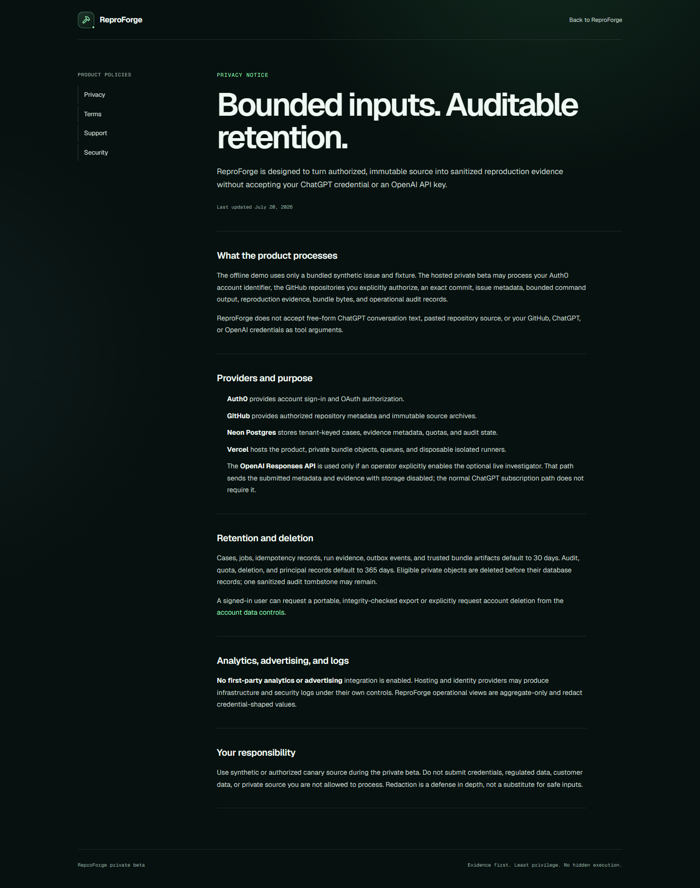
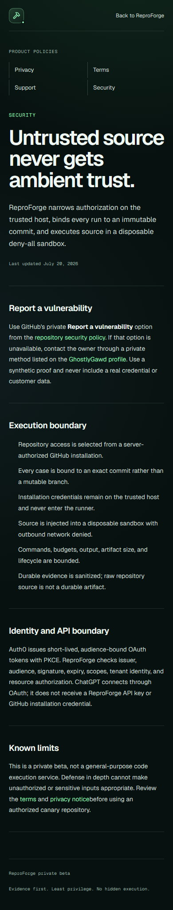

# Milestone 9 hosted public-boundary evidence

This partial milestone record proves the public production boundary at
`891749b4fcce7faabf6424b565cdc45a6eb3cd3a`. GitHub's full verification gate
passed, Vercel promoted the exact preview to production deployment
`dpl_2KwXZ88yZE1fPTa9wXomJKwPiBdm`, and the stable origin was verified after
promotion.

The machine-readable [hosted boundary report](hosted-boundary-report.json)
records public route status, the closed domain-challenge response, selected
security-header assertions, and keyless MCP initialization. The challenge
route returned an empty `404` with `no-store`; it does not expose a placeholder
or verification token when no real challenge is active.

## Production visual evidence

The desktop and mobile images are real first-party captures from
`https://reproforge.vercel.app`, not generated mockups. Their exact route,
viewport, byte count, SHA-256 digest, caption, alt text, capture time, and
sanitization statement are recorded in [the manifest](manifest.json). The
built Playwright run passed all 26 browser checks, including five public-policy
checks and zero automated accessibility violations.

## Scope boundary

This is deliberately partial Milestone 9 evidence. It does not claim Auth0
tenant configuration, a GitHub App installation, signed-in public/private
canaries, a real ChatGPT developer-mode app, or ChatGPT-host screenshots. Those
external-account gates remain open and prevent a completion claim.
