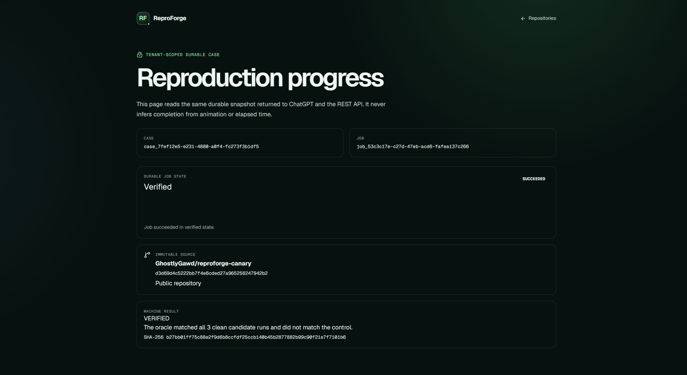

# Production public-canary evidence

**Caption:** First-party production result for the authorized public
`GhostlyGawd/reproforge-canary` fixture pinned at
`d3d69d4c5222bb7f4e6cded27a965258247942b2`.

## Verified result

The signed-in production flow selected the server-issued repository ID from the
GitHub App catalog and started one durable case. The job completed on attempt
one with case state `VERIFIED`, job state `SUCCEEDED`, and progress phase
`VERIFIED`. The isolated runner recorded three of three matching candidate
runs, a clear negative control, repeatability `1.0`, deny-all networking, clean
sandbox cleanup, and one durable private bundle.

The public fixture has five regular files and no dependencies or install-time
scripts. ReproForge acquired the exact immutable commit, ran `test:control`
once and `test:reproduce` three times in fresh microVMs, and produced bundle
hash `b27bb01ff75c88e2f9d6b8ccfdf25ccb140b45b2877882b99c90f21e7f7101b6`.
The stored bundle artifact is 11,327 bytes with SHA-256
`4c3e2fdddc04aae7e3a352bb931952783f9cbbc3cc21376a8452cfd0967d7e39`.

The machine-readable [production gate](production-public-canary-gate.json) and
[capture manifest](manifest.json) retain the exact deployment, source revision,
case/job identity, proof summary, image metadata, and sanitization boundary.

## Provenance and sanitization

This is a real full-page capture from `https://reproforge.vercel.app`, not a
mockup or generated image. The page contains only product chrome, public
synthetic repository metadata, immutable hashes, and server-issued case/job
identifiers. It contains no display name, email address, cookie, credential,
provider repository ID, private repository, customer data, or private source
content.

This artifact proves the signed-in production web, GitHub App, queue, private
object store, isolated runner, oracle, and bundle path. It is deliberately not
claimed as ChatGPT-host evidence. The separate anonymous trusted demonstration
has now passed inside ChatGPT, but `positive-public-canary` stays
`pending_hosted` until its authorized list/start/read/export sequence is also
exercised there.
