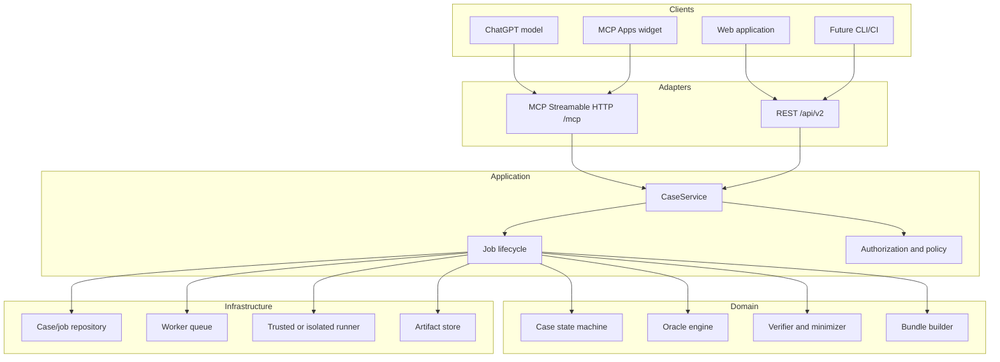

# ReproForge v2 product and platform specification

- **Status:** Approved for implementation
- **Version:** 2.0-draft.1
- **Date:** 2026-07-19
- **Decision:** [API-first core with plugin-first distribution](adr/0001-api-first-plugin-first.md)
- **Delivery plan:** [v2 roadmap](roadmap-v2.md)

## 1. Product promise

> Bring an incomplete bug report to ChatGPT. Get an evidence-backed, independently runnable reproduction—not a plausible guess.

ReproForge is a managed reproduction service with a ChatGPT-native experience. It ingests authorized issue and repository context, runs bounded experiments in disposable isolation, evaluates a versioned failure oracle against a negative control and repeatable clean runs, minimizes the verified case, and returns a portable Repro Bundle.

The primary path uses the user's ChatGPT subscription. It does not require the user to create, pay for, or paste an OpenAI API key. The existing Responses API integration remains optional for standalone automation.

## 2. Product outcome and audience

The first complete product serves maintainers and engineering teams who lose time reconstructing incomplete bug reports. A successful session ends in one of five truthful states:

- `VERIFIED`: a control-safe, repeatable reproduction and valid Repro Bundle exist;
- `UNSTABLE`: the failure was observed but did not satisfy repeatability;
- `NOT_REPRODUCED`: bounded attempts did not match the oracle;
- `BLOCKED`: required access, capability, or evidence was unavailable; or
- `CANCELLED`: the user or policy stopped the job.

Success is never a model confidence score. It is a deterministic proof result.

## 3. Supported journeys

### J1 — Subscription-first trusted sample

1. In ChatGPT, the user asks ReproForge to demonstrate a verified reproduction.
2. ChatGPT calls `start_reproduction` with the bundled `cli-spaces` sample and an idempotency key.
3. ReproForge creates a case/job, runs the trusted flow, and returns stable identifiers plus a concise result.
4. An embedded widget displays case state, evidence classes, hypotheses, control/candidate runs, oracle, and bundle readiness.
5. ChatGPT or the widget calls `get_reproduction` to refresh the same case.
6. `export_repro_bundle` returns a validated portable bundle representation.
7. No `OPENAI_API_KEY` is read or required anywhere in this journey.

### J2 — Standalone trusted sample

The web application performs the same workflow through versioned REST routes backed by the same application service. Browser behavior must remain equivalent to J1 for the shared fields.

### J3 — Authorized repository reproduction

After production boundaries exist, a signed-in user selects an authorized GitHub repository and immutable revision, supplies issue evidence and a budget, confirms the execution boundary, and starts an asynchronous job. ReproForge clones into a disposable sandbox, acquires dependencies under explicit policy, runs bounded experiments, and stores sanitized artifacts. Private content never appears in model-readable tool output unless required and disclosed.

### J4 — Standalone AI-assisted investigation

An operator or API customer may enable the Responses investigator for hypothesis generation. The service owns that credential and billing arrangement. This journey uses the same application and verification contracts and is not required for J1–J3.

## 4. Scope by release gate

| Capability | Trusted plugin slice | Private beta | Public-ready |
|---|---:|---:|---:|
| ChatGPT/MCP no-key journey | Yes | Yes | Yes |
| Embedded evidence widget | Yes | Yes | Yes |
| Standalone web parity | Yes | Yes | Yes |
| Durable cases/jobs/artifacts | No; in-memory | Yes | Yes |
| Public GitHub repositories | No | Yes | Yes |
| Private GitHub repositories | No | Yes | Yes |
| Isolated execution | Trusted fixture only | Managed sandbox | Managed sandbox |
| OAuth 2.1/PKCE | No auth for synthetic sample | Yes | Yes |
| Responses API investigator | Optional | Optional | Optional |
| Rate limits/quotas/retention | Local limits | Yes | Yes |
| Plugin portal submission | No | Draft only | Approved go/no-go |

The trusted plugin slice is an end-to-end product proof, not a claim that arbitrary repositories are safe or supported.

## 5. Platform architecture

### 5.1 Core rule

Transport adapters translate requests; they do not decide product outcomes. `CaseService` is the only entry point for case/job commands and queries. It depends on repository, runner, artifact, authorization, clock, and identifier interfaces.



### 5.2 Application service contract

The first implementation exposes these transport-neutral operations:

```ts
type CaseService = {
  startTrustedReproduction(command: StartTrustedReproduction): Promise<StartResult>;
  getReproduction(query: GetReproduction): Promise<ReproductionSnapshot>;
  exportReproBundle(query: ExportReproBundle): Promise<ExportResult>;
};
```

- `StartTrustedReproduction` includes `sampleId`, a caller-scoped `idempotencyKey`, and an optional execution budget.
- Reusing the same caller and key with the same canonical input returns the original case/job.
- Reusing the same key with different input returns `IDEMPOTENCY_CONFLICT`.
- Queries never mutate state and return `NOT_FOUND` without leaking another caller's identifiers.
- The trusted adapter may finish before returning; the contract still returns both `caseId` and `jobId`.

### 5.3 Job lifecycle

```text
QUEUED -> RUNNING -> SUCCEEDED | FAILED | CANCELLED
```

Job state and case state are separate. A job may fail operationally before a case reaches a domain terminal state. Every job includes creation/update timestamps, attempt number, progress phase, sanitized failure code, and retryability. Worker retries must not duplicate a case, verification run, or bundle.

### 5.4 REST v2

| Method and path | Purpose | Idempotency |
|---|---|---|
| `POST /api/v2/reproductions` | Start a reproduction | Required `Idempotency-Key` |
| `GET /api/v2/reproductions/{caseId}` | Read a snapshot | Read-only |
| `GET /api/v2/jobs/{jobId}` | Poll operational progress | Read-only |
| `GET /api/v2/reproductions/{caseId}/bundle` | Export a verified bundle | Read-only |

Responses use a versioned envelope with `data`, `error`, `requestId`, and `schemaVersion`. Errors have stable codes: `INVALID_REQUEST`, `UNAUTHORIZED`, `FORBIDDEN`, `NOT_FOUND`, `IDEMPOTENCY_CONFLICT`, `UNSUPPORTED_SOURCE`, `RUNNER_UNAVAILABLE`, `BUDGET_EXHAUSTED`, `RATE_LIMITED`, and `INTERNAL_ERROR`. Raw exceptions, commands containing secrets, and provider payloads are never returned.

### 5.5 MCP tool v1

| Tool | Behavior | Annotations |
|---|---|---|
| `start_reproduction` | Start/reuse the trusted sample job | `readOnlyHint: false`, `destructiveHint: false`, `openWorldHint: false` |
| `get_reproduction` | Read a case/job proof snapshot | `readOnlyHint: true`, `destructiveHint: false`, `openWorldHint: false` |
| `export_repro_bundle` | Read the validated bundle for a verified case | `readOnlyHint: true`, `destructiveHint: false`, `openWorldHint: false` |

Each tool has one job, strict input and output schemas, bounded descriptions, machine-readable identifiers, and accurate status text. Start is idempotent because hosts may retry calls. All three tools return useful text and `structuredContent` without a widget. `start_reproduction` and `get_reproduction` point to `ui://widget/reproforge-case.html` for the richer view.

Model-readable `structuredContent` contains only sanitized case state, proof summaries, and reusable identifiers. Rich widget-only display data may use result `_meta`, but secrets and undisclosed personal data are forbidden there too.

### 5.6 Widget

The embedded UI materially improves inspection of evidence, hypotheses, control/candidate runs, and artifact readiness. It:

- initializes the standard MCP Apps bridge;
- renders tool input/results without assuming ChatGPT-specific globals;
- can call read-only refresh/export tools;
- remains usable with keyboard navigation, 200% zoom, reduced motion, and host light/dark themes;
- declares the narrowest CSP and makes no third-party network requests in the trusted slice; and
- treats all tool data as untrusted and escapes rendered text.

## 6. Authentication and authorization

The synthetic trusted sample is `noauth` and stores no personal repository data. Repository access requires OAuth 2.1 authorization code with PKCE and per-tool scopes. The server validates issuer, audience, signature, expiry, scopes, tenant, and repository authorization on every call.

Tokens stay server-side and are never returned through `content`, `structuredContent`, result `_meta`, widget state, logs, or bundles. GitHub installation/repository authorization is independent of ChatGPT authentication and uses least privilege.

## 7. Execution safety

The existing fail-closed runner invariant remains mandatory. Production repository work requires a separate disposable execution service with:

- immutable repository revision input and no host checkout mount;
- non-root identity, dropped capabilities, no container socket, and read-only base image;
- CPU, memory, disk, process, output, wall-time, and tool-call limits;
- no ambient application, OpenAI, GitHub, database, or cloud credentials;
- default-deny network after an explicitly approved acquisition phase;
- signed/hashed runner and environment provenance; and
- cancellation, cleanup, quarantine, and health behavior that fails closed.

Until these controls pass provider and product-consumer validation, external repositories return `RUNNER_UNAVAILABLE` or `UNSUPPORTED_SOURCE`.

## 8. Data, privacy, and retention

Data classes are: account metadata, repository metadata, source snapshots, issue evidence, run artifacts, bundle artifacts, operational logs, and billing/usage records. The trusted slice persists none of them across process restart.

Before private beta, the product must define and implement:

- tenant isolation and per-object authorization;
- encryption in transit and at rest;
- configured retention by data class and deletion/export operations;
- exact secret and personal-data exclusion/redaction boundaries;
- audit events for access, execution, export, deletion, and admin actions;
- regional/provider disclosures; and
- a public privacy policy aligned with actual tool payloads.

## 9. Reliability and operations

- At-least-once queue delivery is assumed; application commands are idempotent.
- A job lease prevents concurrent workers from executing the same attempt.
- Artifacts are content-addressed and written before the success transition.
- State changes use compare-and-swap or database transactions.
- A recovery sweep requeues expired leases within a bounded retry policy.
- Logs carry request, case, job, and attempt IDs but exclude source content and secrets by default.
- Health separates HTTP liveness, dependency readiness, and runner capability.

## 10. TDD, property, BDD, and end-to-end contract

Behavior changes begin with failing tests where practical.

Property invariants include:

- the same caller/key/input produces exactly one case and job;
- conflicting input under the same key never reuses work;
- serialization round-trips preserve schema-valid snapshots;
- terminal jobs never return to active states;
- transport mappings cannot produce a domain `VERIFIED` state without the existing oracle/control/repeatability proof;
- model-readable MCP output never contains registered secrets; and
- retry sequences do not duplicate bundle identity or run evidence.

Executable BDD covers subscription-first start/poll/export, idempotent retry, invalid input, unknown case, blocked runner, unstable/not-reproduced outcomes, and keyless operation. Browser verification covers the standalone app and widget harness. Protocol tests exercise MCP initialize, tool discovery, tool calls, schemas, annotations, and resource retrieval.

## 11. Acceptance criteria

### Trusted plugin slice

- A clean environment with no `OPENAI_API_KEY` completes J1 through the MCP server.
- MCP discovery exposes exactly the supported tools with accurate schemas and safety annotations.
- Repeating `start_reproduction` with the same key returns the same IDs and executes once.
- The trusted sample produces three matching candidates, a non-matching control, a valid bundle, and `VERIFIED`.
- REST and MCP snapshots agree on case, job, summary, and bundle identity.
- Unit/property/BDD/build/eval/browser/accessibility checks pass.
- Sanitized widget screenshots and an MCP protocol transcript are committed with provenance.

### Private beta

- A user can authorize a selected GitHub repository without exposing tokens to ChatGPT or the widget.
- Jobs survive process restart and recover safely from worker interruption.
- External work executes only in the validated isolated runner.
- Tenant-isolation, retention/deletion, rate-limit, backup/restore, and abuse tests pass.

### Public readiness

- A stable HTTPS MCP endpoint passes ChatGPT developer-mode and review test cases.
- Publisher identity, domain, privacy, terms, support, CSP, listing, logo, screenshots, five positive cases, and three negative cases are complete.
- Security, accessibility, load, failure-mode, and rollback evidence is reviewed.
- Public submission and publication occur only after an explicit go/no-go decision.

## 12. Success metrics

| Metric | Trusted slice target | Beta target |
|---|---:|---:|
| User-supplied OpenAI keys in primary flow | 0 | 0 |
| False `VERIFIED` results in contract/eval suite | 0 | 0 |
| Idempotent duplicate executions | 0 | 0 |
| Required bundle-file completeness | 100% | 100% |
| Trusted sample completion | < 30 seconds local | < 60 seconds hosted |
| Critical automated accessibility violations | 0 | 0 |
| Cross-tenant authorization escapes | N/A | 0 |
| Sandbox policy escapes in security suite | N/A | 0 |

Real-world reproduction accuracy and latency targets require a representative, licensed corpus before they can be claimed.

## 13. Non-goals

- Letting ChatGPT, an MCP client, or a model declare proof without deterministic verification.
- Requiring users to bring an OpenAI API key for the primary product.
- General autonomous bug fixing or pull-request publication.
- Running repositories on the web/API process or developer host.
- Supporting every language/runtime in the first production release.
- Claiming globally minimal reproductions.
- Publishing a plugin, changing repository settings, or provisioning paid production infrastructure without the corresponding explicit gate.

## 14. Completeness statement

The plan is complete as a delivery sequence: it covers product surface, transport contracts, jobs, persistence, authentication, authorization, execution isolation, privacy, operations, verification, deployment, and submission. It is not yet a completed production product. Provider selection, credentials, domain/identity ownership, hosting spend, and public publication are decision gates, not details that can be truthfully completed in source code alone.

