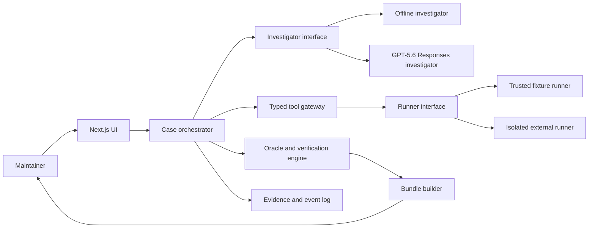

# ReproForge product and technical specification

- **Status:** Implemented for the trusted-fixture MVP; retained as the v1 baseline
- **Version:** 1.1
- **Date:** 2026-07-19
- **Track:** OpenAI Build Week — Developer Tools

The approved productization direction is defined in the [ReproForge v2 specification](product-spec-v2.md). This document remains the acceptance record for the merged local MVP.

## 1. Product contract

ReproForge converts a repository plus an incomplete bug report into a deterministic Repro Bundle. The bundle contains a minimal failing test or script, pinned environment facts, a machine-readable failure signature, a one-command reproduction, and an evidence-linked investigation record.

The product promise is:

> Issue in. Deterministic, one-command failing reproduction out.

## 2. Problem and audience

Maintainers and engineers routinely receive bug reports that omit the environment, dependency versions, state, inputs, timing, or sequence needed to recreate the failure. Existing issue templates depend on reporters knowing which facts matter. General coding assistants can speculate about causes or fixes without first proving the bug exists.

The primary user is an open-source maintainer triaging an incomplete issue. Secondary users are application engineers, QA engineers, support engineers, and contributors preparing high-quality bug reports.

The core job is:

> When I receive a plausible but incomplete bug report, produce a minimal, repeatable failing case with trustworthy evidence so I can begin diagnosis from proof instead of a conversation.

## 3. Product principles

1. Prove before explaining.
2. Produce artifacts, not merely answers.
3. Keep evidence separate from inference.
4. Mutate only disposable workspaces.
5. Treat repeatability as part of correctness.
6. Require explicit approval for network, secrets, publishing, or other consequential boundaries.
7. Show concise rationales and evidence, never hidden chain-of-thought.

## 4. MVP decisions

| Area | Decision |
|---|---|
| Primary surface | Local-first Next.js App Router application |
| Supported input | Bundled trusted JS/TS fixture for the complete demo |
| External repositories | Disabled until an isolated runner is configured |
| Package managers | Bundled demo pins npm; automatic repository detection is deferred |
| Execution platform | Runner interface with a trusted-fixture adapter and fail-closed external adapter |
| Model | `gpt-5.6-sol` through the Responses API |
| Model reasoning | Explicit `medium` baseline, measured before tuning |
| Offline behavior | Deterministic investigator provides the full sample journey without credentials |
| Persistence | In-memory/sample state for MVP; artifact files for exported evidence |
| Automatic fixing | Out of scope; reproduction only |
| Publishing | User-reviewed artifacts only |

The product uses the Responses API because the investigation requires reasoning and typed tool calls. Programmatic Tool Calling, multi-agent beta, Pro mode, and persisted reasoning are deliberately outside the baseline until evals demonstrate a need.

## 5. Golden path

1. **Ingest:** Load a trusted sample issue, repository revision, optional logs, and a bounded execution budget.
2. **Inspect:** Identify project structure, runtime, relevant files, commands, unknowns, and candidate failure oracles.
3. **Hypothesize:** Create a small ledger of falsifiable hypotheses with expected and falsifying signals.
4. **Experiment:** Execute bounded, typed experiments and record commands, patches, outputs, timing, and outcomes.
5. **Verify:** Match an explicit oracle, pass a negative control, and reproduce on three clean runs.
6. **Minimize:** Remove unnecessary inputs or setup while retaining the oracle.
7. **Package:** Export the one-command reproduction, lock data, oracle, patch, logs, and issue-ready summary.

## 6. Case states

```text
DRAFT
  -> INGESTING
  -> INSPECTING
  -> HYPOTHESIZING
  -> EXPERIMENTING
  -> VERIFYING
  -> MINIMIZING
  -> PACKAGING
  -> VERIFIED | UNSTABLE | NOT_REPRODUCED | BLOCKED | CANCELLED
```

Invalid transitions are rejected. Every terminal outcome includes an evidence-backed explanation.

## 7. Verification contract

A candidate reproduction becomes `VERIFIED` only when all conditions hold:

1. A versioned, machine-readable oracle exists before verification.
2. The candidate matches that oracle on three clean runs by default.
3. A negative control does not match the same oracle.
4. Runtime, dependency, repository, and relevant environment facts are pinned or documented.
5. The final exported bundle passes an independent validation run.

An intermittent candidate becomes `UNSTABLE` with its observed reproduction rate. A candidate that never matches becomes `NOT_REPRODUCED`. Missing capability or evidence becomes `BLOCKED`.

## 8. Failure oracles

P0 oracle types are:

- exit code;
- exact or regular-expression output signature;
- structured JSON field match;
- test assertion identity; and
- composite `all`, `any`, and `not` expressions.

Oracle evaluation is pure, deterministic, and independent of GPT-5.6. Changing an oracle invalidates prior verification results.

## 9. Repro Bundle

```text
repro-bundle/
  REPRO.md
  reproforge.lock.json
  failure-signature.json
  reproduction.patch
  artifacts/
    redacted-run-log.jsonl
    hypothesis-ledger.json
    minimization.json
    verification-summary.json
```

The lock file includes the repository and immutable revision, tree hashes, runtime and package-manager versions, dependency lock hash, runner identity, commands, relevant non-secret environment facts, oracle version, and ReproForge version.

## 10. Functional requirements

### RF-01 — Case ingestion

The system accepts the trusted sample case and validates its repository, revision, issue evidence, and budget.

### RF-02 — Evidence classification

Every evidence item retains its source and is classified as `reported`, `observed`, `inferred`, or `unknown`. Conflicts remain visible.

### RF-03 — Hypothesis ledger

Each hypothesis has supporting evidence, an expected signal, a falsification condition, a priority, and a durable status history.

### RF-04 — Runner isolation boundary

All commands pass through a runner interface. The trusted-fixture runner accepts only bundled fixture IDs and allowlisted commands. The external runner refuses work when no isolated backend is configured.

### RF-05 — Typed experimentation

Investigator tools use strict schemas. Every command and proposed file change is recorded. No tool can mutate the source checkout or publish externally.

### RF-06 — Deterministic oracle engine

The oracle engine evaluates captured run results with no model participation and emits an explanation suitable for the audit timeline.

### RF-07 — Clean-run verification

The verifier performs a negative control and three clean candidate runs, records the environment identity, and calculates repeatability.

### RF-08 — Minimization

The minimizer accepts only a reduction whose fresh verification preserves the failure and control behavior. It never claims mathematical minimality.

### RF-09 — Bundle export

The bundle schema is versioned, serializable, hashable, redacted, and independently validatable.

### RF-10 — Investigation UI

The browser experience exposes the current phase, evidence, hypotheses, experiments, oracle, verification runs, budget, and final bundle without exposing hidden model reasoning.

### RF-11 — Offline and live investigators

The offline investigator produces a deterministic sample journey. The live investigator uses GPT-5.6 Sol only when `OPENAI_API_KEY` is available and never changes the verification contract.

### RF-12 — Evaluation mode

Fixtures pin their inputs and expected outcomes. The evaluator measures correctness, false positives, repeatability, duration, and bundle completeness.

## 11. Architecture



The case orchestrator owns the state machine, budgets, and terminal outcomes. The investigator proposes evidence-linked experiments. The runner executes only permitted work. The deterministic verifier—not the investigator—decides success.

## 12. GPT-5.6 contract

GPT-5.6 is responsible for:

- structuring heterogeneous issue evidence;
- mapping issue language to repository areas;
- proposing falsifiable hypotheses and low-cost experiments;
- selecting typed, bounded tools;
- interpreting experiment results without erasing contradictions; and
- drafting an evidence-linked handoff.

Deterministic application code is responsible for:

- permissions and execution boundaries;
- state transitions and budgets;
- command execution and hashing;
- oracle evaluation, control runs, and repeatability;
- redaction and bundle validation; and
- the final `VERIFIED` decision.

The live request uses a lean outcome-oriented prompt, explicit autonomy boundaries, strict tool schemas, and an explicit reasoning effort. It preserves response output items during tool continuation. Model and prompt changes must be evaluated against the same fixtures.

## 13. Security and privacy

External repository execution is unavailable unless a real isolated runner is healthy. The planned isolated adapter must run non-root, drop capabilities, impose CPU/memory/disk/process/time limits, deny host mounts and the container socket, remove ambient secrets, and default-deny network access after dependency acquisition.

The application never requests production credentials. Logs and bundles are redacted before persistence or display. The trusted fixture runner rejects unknown fixture IDs, paths outside the fixture root, and commands outside its allowlist.

## 14. Accessibility and UX

- All status changes are conveyed with text, not color alone.
- The entire golden path is keyboard operable.
- Streaming/progress regions use appropriate live-region behavior without excessive announcements.
- Code, command, and log content is copyable and readable at 200% zoom.
- Animations respect reduced-motion preferences.
- Empty, loading, error, blocked, cancelled, unstable, and success states are designed explicitly.

## 15. MVP success criteria

| Metric | Target |
|---|---:|
| Trusted golden-path completion | Under 5 minutes |
| Verification reruns | 3 of 3 match |
| Negative control | 0 matches |
| Bundle required-file completeness | 100% |
| Property-test runs | At least 100 generated cases per invariant |
| Critical BDD scenarios | All pass |
| Judge/sample setup | Under 5 minutes |
| Critical accessibility violations | 0 in automated scan |

## 16. Non-goals

- Automatic fixes or pull requests.
- Production attachment or live incident debugging.
- Arbitrary languages or operating systems.
- Proprietary hardware or unavailable third-party dependencies.
- Mathematical proof that a reproduction is globally minimal.
- Autonomous external publishing.

## 17. Hackathon alignment

- **Technological implementation:** typed model tools, an auditable state machine, deterministic verification, property-tested invariants, and portable artifacts.
- **Design:** a complete issue-to-bundle experience with truthful uncertainty and polished terminal states.
- **Potential impact:** less maintainer time spent reconstructing incomplete reports.
- **Idea quality:** a runnable artifact and proof system rather than a repository chatbot.

## 18. Official references

- [OpenAI Build Week](https://openai.devpost.com/)
- [OpenAI Build Week FAQ](https://openai.devpost.com/details/faqs)
- [GPT-5.6 model guidance](https://developers.openai.com/api/docs/guides/latest-model?model=gpt-5.6)
- [OpenAI function calling](https://developers.openai.com/api/docs/guides/function-calling)
- [OpenAI structured outputs](https://developers.openai.com/api/docs/guides/structured-outputs)

