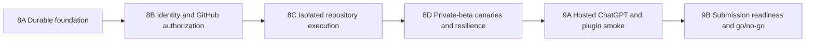

# ReproForge remaining delivery plan

- **Status:** approved for execution
- **Plan version:** 1.0
- **Date:** 2026-07-19
- **Starting point:** `main` at `62bd54e62c44dff31797657b52e184e991410503`
- **Product direction:** API-first core, plugin-first distribution
- **Tracking parents:** [Milestone 8](https://github.com/GhostlyGawd/reproforge/issues/13) and [Milestone 9](https://github.com/GhostlyGawd/reproforge/issues/14)

This package defines everything still required to turn the verified trusted
fixture into a useful hosted product. It is intentionally ordered by trust and
dependency. A later milestone may not claim completion while an earlier gate is
unverified.

## Product completion definition

ReproForge v2 is complete only when an authorized user can connect from
ChatGPT without supplying an OpenAI API key, select a GitHub repository they
are allowed to use, pin an immutable revision, run a bounded reproduction in a
disposable isolated environment, inspect truthful progress and proof, and
export an independently runnable Repro Bundle. The service must survive
restarts, isolate tenants, enforce retention and quotas, and have the hosted,
security, operational, legal, and review evidence required for a public plugin
decision.

The user's ChatGPT subscription supplies the conversational host. ReproForge
owns its MCP service, identity integration, persistence, repository access,
execution, storage, and provider costs. No user OpenAI API key is part of the
primary path.

## Fixed implementation baseline

The reviewed baseline is recorded in
[ADR 0002](../adr/0002-managed-production-stack.md):

| Boundary | Baseline | Portability seam |
|---|---|---|
| Web and MCP | Vercel-hosted Next.js functions | standard `Request`/`Response` adapters |
| Identity | Auth0 OAuth 2.1 authorization code + PKCE | `AccessTokenVerifier` and `PrincipalResolver` |
| Repository authorization | least-privilege GitHub App | `SourceAuthorization` and `SourceAcquirer` |
| Durable state | Neon Postgres with migrations | repository and transaction interfaces |
| Artifact storage | private Vercel Blob, content-addressed | `ArtifactStore` |
| Async delivery | Vercel Queues with a transactional outbox and recovery sweep | `JobQueue` |
| Untrusted execution | Vercel Sandbox disposable microVM | `IsolatedRunner` |
| Rate limits | durable quota ledger; optional Upstash acceleration | `QuotaPolicy` |
| Model assistance | absent by default; optional service-owned Responses adapter | existing investigator interface |

Provider SDKs never enter domain code. The trusted fixture remains available
and keeps its current no-auth, no-external-execution guarantees.

## Delivery order



| Order | Specification | Product result | Entry dependency |
|---:|---|---|---|
| 1 | [8A — Durable foundation](milestone-8a-durable-foundation.md) | restart-safe, tenant-keyed cases/jobs/artifacts and queue recovery | Milestone 7 merged |
| 2 | [8B — Identity and GitHub authorization](milestone-8b-identity-and-github.md) | OAuth-authenticated principals and least-privilege repository selection | 8A green |
| 3 | [8C — Isolated execution](milestone-8c-isolated-execution.md) | bounded public/private repository work in disposable isolation | 8B green |
| 4 | [8D — Private beta](milestone-8d-private-beta.md) | authenticated end-to-end canaries, recovery, retention, and operations | 8C green |
| 5 | [9A/9B — Hosted launch readiness](milestone-9-hosted-launch.md) | stable ChatGPT app, plugin wrapper, review pack, and explicit submission decision | 8D green |

## Per-task execution protocol

Every task uses the same evidence-bearing loop:

1. Link the task to a requirement and an observable acceptance criterion.
2. Add the narrowest failing unit, integration, property, contract, BDD, or
   browser test that would disprove the missing behavior.
3. Record the expected red result in the milestone evidence log.
4. Implement without weakening an oracle, schema, tenant boundary, or sandbox
   policy.
5. Run the narrow test and adjacent suites; record the green result.
6. Run the milestone gate, inspect generated/runtime behavior, and attach
   sanitized non-visual or visual evidence as applicable.
7. Update README, architecture, security, privacy, limitations, provenance,
   release status, and the completion audit when the behavior changes.
8. Commit and push a focused branch, open a reviewed pull request, require
   green CI, and merge before starting a dependent milestone.

If a behavior depends on an external provider, a fake adapter proves only the
application contract. Completion additionally requires a provider integration
test in a non-production environment. A mock, file presence, or successful
deployment alone is never sufficient.

## Verification matrix

| Concern | Required proof |
|---|---|
| State and concurrency | Vitest integration tests against real Postgres semantics plus fast-check sequences for idempotency, leases, terminality, and serialization |
| Identity and authorization | signed-token contract fixtures, metadata discovery, issuer/audience/expiry/scope checks, cross-tenant denial properties, OAuth browser smoke |
| GitHub access | installation/repository permission contract tests, immutable revision check, public and private canaries, token non-disclosure scan |
| Queue and recovery | at-least-once duplicate delivery, outbox dispatch, lease expiry, bounded retry, cancellation, and restart recovery tests |
| Runner isolation | sandbox provider integration, default-deny execution phase, resource/output limits, credential absence, path/symlink/archive properties, cleanup proof |
| Domain truth | existing oracle/control/three-run properties plus repository canaries that cannot set `VERIFIED` outside deterministic verification |
| Artifacts | content-addressing, private access, round-trip, redaction, deletion, retention, and restore tests |
| User journeys | executable Gherkin for auth/start/poll/cancel/export/denials and Playwright for dashboard/widget/ChatGPT-hosted evidence |
| Operations | liveness/readiness/runner health, structured redacted logs, metrics, alerts, backup/restore, load, failure injection, and rollback rehearsal |
| Submission | exactly five positive and three negative review cases, public policy/support pages, domain/publisher evidence, final CSP/listing, recorded go/no-go |

## Global commands and milestone gates

The repository keeps `npm run verify` as the local release gate. Production
milestones extend it with deterministic commands rather than replacing it:

```text
npm run verify
npm run test:integration
npm run test:security
npm run test:load
npm run verify:evidence
```

Commands are added only when their implementation exists. CI runs the offline
gate for every pull request and provider-backed suites in an authorized,
secret-scoped environment. Provider tests must fail closed or report an
explicit skip reason; a skipped provider gate cannot close a provider task.

## External decision gates

Implementation authority does not fabricate external facts. These items need
real account-side evidence at their point in the sequence:

- Vercel project and paid-resource provisioning;
- Auth0 tenant/application and GitHub App creation;
- private canary repository installation;
- stable domain and DNS ownership;
- ChatGPT developer-mode app ID and supported-plan access;
- publisher identity, legal URLs, reviewer account, and portal access; and
- final public submission/publication approval.

Until exercised, each remains unchecked and the full product goal remains
active.

